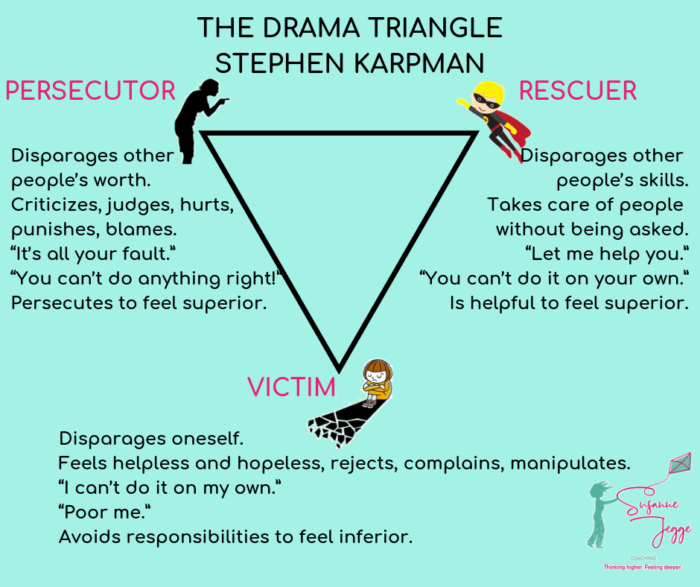
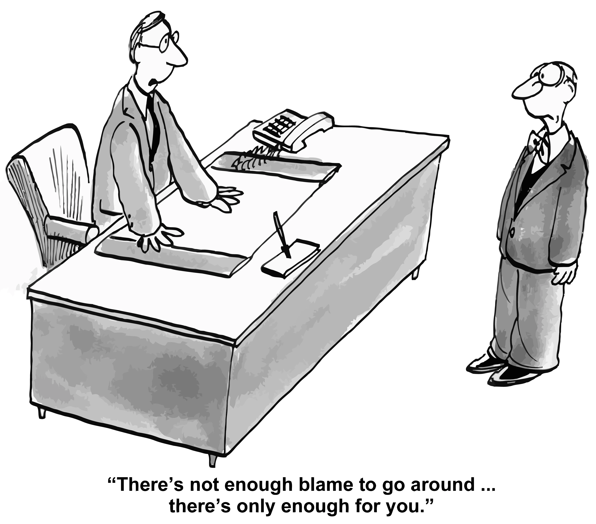
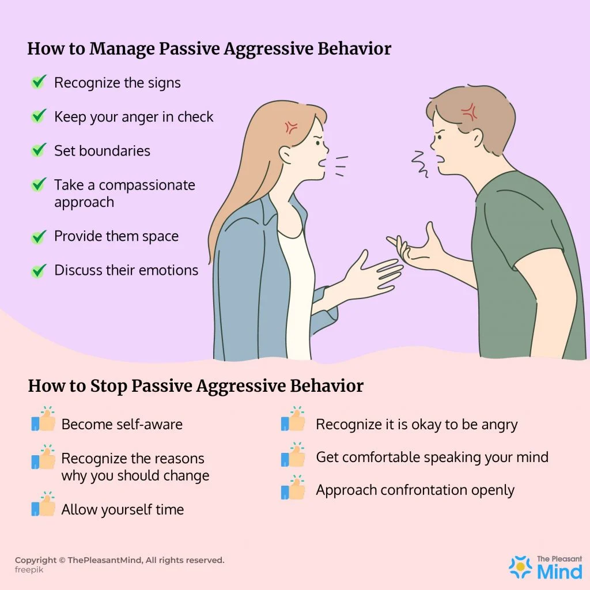
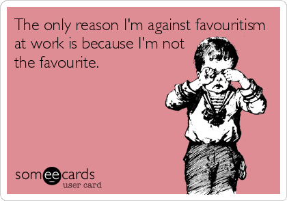
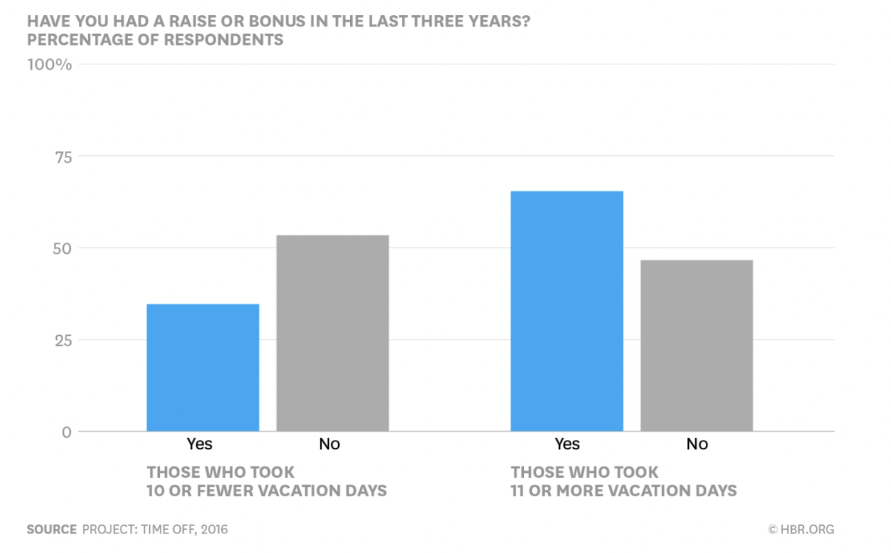

We put many masks every day. We play games in private life and at work. Sometimes we play them intentionally, another time we play them completely subconsciously. Sometimes we play positive roles, sometimes negative ones. At work people play the roles of omniscient leaders, unmoved bosses, friendly managers, caring colleagues or others. They put masks to be perceived as more professional or important, to feel appreciated, to avoid offending someone, to stay diplomatic, to protect themselves. There are dozens of reasons people wear masks. **The problem appears when we forget who we really are, when we hurt others in our games, and when our main goal is gaining control and manipulation.** 

## **why do we play?**

**People play games to win. And they usually win emotions.** Depending on the game they play they can win both positive and negative reactions. 

### **Among the most common “winnings” you can find:**

* improving own self-esteem at the expense of others, 
* the humiliation of people you work with, 
* causing unjustified guilt, 
* justifying anger and unacceptable behaviours, 
* maintaining self-image by ignoring someone’s feelings, 
* getting praise you don’t deserve,  
* feeding on popularity and other people’s attention. 

**The misfortune of these winnings is that they often result in arousing negative feelings in others.** Usually people you work with or live with. 

## **how did it start?**

Probably the first person who wrote about playing psychological games by people was [Eric Berne ](https://www.itaaworld.org/eric-berne-founder) who is also the creator of transactional analysis. **Berne said that the reason why people play games is obtaining some kind of pay-off.** This pay-off might be both positive and negative external stimuli or reaction such as gesture, talk, emoticon etc. It can be  obtained either in face to face contact or online in a digital world. We just want to be important. We just want to be noticed. 

In fact, people have been always playing games - to win battles, to compete, to get promoted, but also to cooperate or build thrust. But the problem appears when we do not get what we want, when we don't get positive reactions we would feed on negative ones. 

**One of the first game everyone has played in life is drama triangle.** [The drama triangle](https://www.youtube.com/watch?v=E_XSeUYa0-8&t=104s) is a psychological model proposed by Stephen B. Karpman. **In the drama triangle we have three personas: victim, persecutor and rescuer - we can take the roles interchangeably depending on the circumstances.** You put a particular mask depending on the context you find yourself in. You are not always a victim or rescuer or persecutor. Your role changes.  

###### Source: [https://www.susannejegge.com/en/2019/05/29/drama-triangle-part-2](https://www.susannejegge.com/en/2019/05/29/drama-triangle-part-2/)

Despite its potential risks and limitations - as the model implies a passive stance for individuals within the roles seen as acting out predetermined patterns - the drama triangle can be also used to gain insights about dysfunctional behaviours both in private and professional situations. If you want to use it, please be cautious to avoid any fixed judgements. 

## **most common psychological games at work 🔎**

Very often psychological games in the workplace refer to interactions that involve hidden agendas, manipulation, power dynamics, and other subtle psychological tactics. The most common ones which I have observed and which can occur in many organisations are presented below. 

### 1. The blame game

It involves shifting blame or responsibility on others to avoid taking accountability for one's actions. **Blaming others help people protect their self-esteem. It allows them to maintain a positive self-image by casting themselves as the victim or the innocent party in a situation.**

 https://www.youtube.com/watch?v=RZWf2_2L2v8&t=1s

In fact we have a natural tendency to blame other people or circumstances when things go wrong. This inclinations is driven by** [the fundamental attribution bias](https://www.betterup.com/blog/fundamental-attribution-error)**. We tend to believe that what people do is a reflection of who they are, rather than considering there might be other factors affecting their behaviour. We have to also remember that some individuals may resort to blaming others because they lack effective communication skills. **They may not know how to express their feelings or concerns in a constructive manner and instead resort to blame as a way of communicating their frustrations.**

### 2. Scapegoating

Similar as in the blame game scapegoating is **a psychological defense mechanism of denial through projecting responsibility and blame on others.** It happens mostly when someone blames a specific individual or group at work for larger issues or failures within the organization to divert attention from the real causes.

### 3. Office gossiping

Spreading rumours or negative information about colleagues or clients is also a type pf psychological game, usually played to create tension and manipulate social dynamics. Those who possess insider information or spread rumours may feel a sense of influence over others. **What is interesting, in competitive workplaces, employees may engage in gossip to undermine or discredit their colleagues. This can be driven by feelings of insecurity or a desire to gain a competitive advantage.** We have to note that while gossiping may serve some entertainment and informational functions for people, in most cases it has negative consequences and leads to misunderstandings, conflicts, and a toxic work environment. Sometimes the person who spreads rumours plays also the role of victim from the drama triangle. 

### 4.Passive-aggressive behaviour

**When you indirectly express hostility or disagreement through subtle actions, sarcasm, or backhanded compliments you also play the game. Have you ever thought that in this way you very often just avoid honest and open communication of what you really want to achieve?** 

Passive-aggressive behaviours in the workplace can manifest in various ways. Among the most common ones we can find: 

😵‍💫 consistently delaying tasks or assignments without a valid reason, leading to missed deadlines and negatively affecting team productivity, 

😵‍💫 offering compliments that are actually disguised criticism or sarcasm,

😵‍💫 sabotaging projects by withholding information, resources, or assistance, 

😵‍💫 withholding information or updates with colleagues or team members, even when it's necessary for their work,

😵‍💫 undermining decisions made by other team members or management by expressing doubt, skepticism, or pessimism, which can erode trust and morale, 

😵‍💫 complaining frequently about work-related issues without taking constructive action to address or resolve them,

😵‍💫 reacting defensively or dismissively to constructive feedback, making it challenging for others to provide input or suggestions,

😵‍💫 excluding certain colleagues or team members from meetings, discussions, or social activities as a form of passive-aggressive punishment.

### 5. Credit stealing

I have witnessed at least a few times during my professional career **people who were taking credit for someone else's work or ideas to enhance their own reputation**. I believe that many of them were doing that subconsciously, but still you have to keep in mind that this game is diminishing contribution of others a lot and in consequence makes them feel demotivated and annoyed. 

**Why do people hog credits? Of course, as in any game - to win.** 

Some have a strong desire for recognition and praise, and they take credit for others' work to boost their status and reputation within the organization. Some fear the consequences of failures or making mistakes and they take credit for work they didn't do to avoid being associated with any potential failures or shortcomings. In some cases, individuals simply have a lack of ethical principles and are willing to engage in deceptive behaviors to achieve their goals or maintain their image. **Remember that credit stealing is detrimental to your workplace relations, trust and morale. It can damage the best collaboration.** Remember that if you are a manager, you play a crucial role in setting the tone and ensuring that credit is appropriately attributed to those who deserve it in your team.

**If you are not sure if your are a credit hogger, I really recommend you doing a simple exercise proposed by Marshal Goldsmith in the article [Do You Work With a Credit Hog?](https://www.entrepreneur.com/growing-a-business/do-you-work-with-a-credit-hog/242380)** **published in *Entrepreneur* a few years ago.** Still very relevant. 

### 6. Playing favourites

The game is played mainly by leaders, managers or bosses, but it also functions among co-workers. Showing preferential treatment to certain team members while excluding or marginalising others always leads to divisions and resentment. 

It is fully understandable that people naturally have personal preferences, and these biases can even unintentionally appears at work. The example might be **a manager favouring an employee because they share similar interests, personalities, or backgrounds (more about the most common cognitive biases we have you can read in [my previous blog post](https://brightinventions.pl/blog/cognitive-bias-how-it-affects-our-hiring-decisions/)).** 

If you experience favouritism in your team or at your work, remember you can always ask for constructive feedback from your supervisor on your performance. This shows your commitment to improvement and may help counteract any negative perceptions.

### 7. Micromanaging

For some it might be surprising to find micromanagement here, but in my humble opinion it is also a type of psychological game. **When you excessively monitor and control other people’s work, frequently you want to show your dominance or create a sense of dependency.** With a strong need for control micromanagers feel that things may go wrong without their direct oversight.

The fear may result from a desire for perfection, lack of trust based on past experiences,  mistakes or just insecurity of the own expertise. In general, people who love micro managing believe that their involvement is essential for achieving positive results. On the other hand, we should not forget that micromanagers may be also under significant pressure to meet deadlines or achieve results. This pressure can make them more controlling as they try to ensure that everything goes according to plan. **Some of them may also lack the skills or knowledge to effectively delegate tasks or they are just new in the managerial world and they may micromanage until they gain more experience and self-assurance.**

**One thing we know for sure is that uncontrollable micromanagement can stifle employee autonomy, hinder creativity, and damage morale.** Employees often prefer a more hands-off approach from their managers. First of all, it allows them to take ownership of their work and feel reponsible for what they do. Let your team members make their own independent decisions. **Instead of micromanagement develop microencouragement in your teams.** 

### 8. Martyrdom

**Working long hours, taking on excessive responsibilities, or portraying oneself as indispensable to gain recognition or manipulate sympathy - welcome in the world of work martyrs.** As everyone work martyrs want to feel important and want to feel noticed. Kim Scott wrote [a very interesting article about navigating a work martyr culture](http://6%20Tips%20for%20Navigating%20a%20Work%20Martyr%20Culture) -  it is essential to be aware of the fact that **leaving the martyr’s zone is not always easy to do for a person who is experiencing that.** 

If you have a tendency to take on your plate more than you can eat and you don't do it to boost your ego, you will have to work hard to change your habits. What helps? 

✅ Learn to say ‘no’ to certain projects or activities, especially ones that are low stakes and take you off focusing on your priorities. You have to start asking yourself what kind of impact each of the has on you. 

✅ Stop taking on other people’s feelings and setting boundaries. You can see and identify someone’s feelings without having to fix them or make them better.

✅ Share responsibility with others especially if you want them to grow.

✅ Stop micromanaging. 

✅ [Take time off.](https://thecontextofthings.com/2016/08/20/work-martyr/) It pays off. 😉 

### 9. Fear mongering

Mostly present in the media, but we can also experience that at work. [Fear mongering is a form of manipulation by exaggerating potential negative outcomes, rumours or consequences to influence decisions or actions of others.](https://www.forbes.com/sites/lizryan/2017/03/07/ten-unmistakable-signs-of-a-fear-based-workplace/) 

If you feel that fear mongering is present in your team, you can always try to take some step to mitigate it. **First of all, try to stay informed and be aware of the information being circulated and critically assess its accuracy and relevance.** Ensure you have reliable sources of information within the organization - not gossips. 😇 Regardless of your role (you don’t have to be a leader or manager to do that) - encourage open and transparent communication within your team so that people around you will feel comfortable sharing concerns and ideas without fear of retribution. 

What is also really valuable is challenging unsubstantiated claims. **If you next time encounter fear-mongering or baseless rumors, calmly and respectfully challenge them with facts and evidence.** **And if you see that fear-mongering originates from a lack of communication or unclear directives from leadership, seek clarification from higher-ups.** There is always something you can do to take the lead in implementing changes or improvements in the workplace. 

### 10. Psychological projection

[It is a defence mechanism where individuals attribute their own undesirable traits, thoughts, or feelings to someone else.](https://personalitygrowth.com/what-is-psychological-projection/) That is why, it is said that people around us are a perfect mirror of our inner relationship with ourselves. 

[The psychological projection can manifest in various ways in the workplace. ](https://helpfulprofessor.com/psychological-projection-examples/)You can find there almost any games presented above such as blaming others (in psychological projection someone who is unwilling to accept responsibility for their mistakes may project their own errors onto coworkers), gossiping (it can be a form of projection, as individuals may project their own insecurities or frustrations onto others leading to rumours), micromanagement (leaders who struggles with trust issues may project their need for control onto their team resulting in micromanagement).  

https://www.youtube.com/watch?time_continue=1&v=5udJgxOBrtk&source_ve_path=Mjg2NjY&feature=emb_logo

**[The other popular examples are:](https://brightside.me/articles/why-a-person-may-project-their-insecurities-onto-others-and-how-to-prevent-them-from-hurting-you-802645/)** 

* judging co-workers (an employee who struggles with feelings of inadequacy might project their insecurities onto colleagues unfairly judging or criticizing their work), 
* assuming that your team members have ulterior motives, even when there's no evidence to support such claims (for example, assuming a colleague is trying to sabotage your career), 
* attributing your own emotions (misinterpreting colleagues' reactions and assuming they feel the same way), 
* projecting your own insecurities onto colleagues, doubting their competence because your feel insecure about your abilities,
* and many others. 

### what can you do to stop playing games? 

Our life is full of nonobjective facts, in fact it is full of beliefs which are not true. We use these beliefs to interpret the reality around us. **You have to be aware that when one thought appears in your mind and you believe it to be true - it becomes a belief. This belief will affect your behaviour and you will be acting in such a way to make this belief true.** By doing so, you are proving yourself you are right. When you accept one belief as true, you will be doing everything to make it true. 

It's important to recognize that playing the blame game is generally connected with our beliefs, it is unproductive and can harm relationships, personal growth, and problem-solving. **Healthy communication, self-reflection, and accountability are better ways to address issues and conflicts than putting masks.** 

And how about you - have your ever thought which games you are playing at work or in your private life? Is it really worth it? 🙂