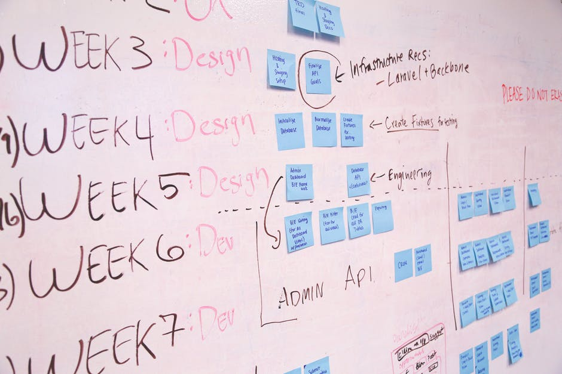

LUKE:  Master, moving stones around is one thing. This is totally different!\
YODA: (irritated) No! No different! Only different in your mind. You must unlearn what you have learned.\
LUKE: (focusing, quietly) All right, I'll give it a try.\
YODA: No! Try not. Do or do not! There is no try.

How many times in your life of a professional developer have you tried to do something despite the fact that you knew that you would not succeed? How many times have you tried to finish a project earlier just because your manager asked you to, but from the beginning you knew you would not meet a new deadline? How many times have you promised to add hundred of new features to your demo in two weeks although it would normally take two months? We do it. Let us face it. We do it all the time - we promise things that we cannot achieve. We promise to do something even though it is beyond our capacity. And all this happens because we told someone that we would give it a try. Yet trying is not always enough. 

## **Professionals say no**

Last time I was writing about being a professional developer and we all know that the more professional we are, the better results we achieve and the better code we may create. But there is one thing more that is an integral part of professionalism - the ability of saying no. That is right. There is no mistake here. Professional developers are not afraid of  saying no. They can oppose or disagree with their teammates, managers or CEOs when  they see their goal is put at risk. Your manager asks you to meet impossible deadlines, clients nag you about creating a full demo in two weeks instead of estimated four months, you realise that a project your CEO wants you to do cannot be done for tomorrow because you have to finish ten other things… All these situations require saying no and in all of these situations you have to defend your goal. Your goal here is not only creating a good clean code, but also taking care of yourself. If you have in mind a justified logical reason why you cannot do something in a period of time you are asked to, remember that disagreeing is not showing weakness or lack of respect. Saying no means that you care about the quality of your work, your code, your team and above all of your goal.

## **Promising the moon** 

Do not promise when you know that you cannot deliver. Even when your manager demands, persuades and challenges you, do not do that. Why? Because you know deeply inside that you cannot achieve it and saying that you will try, does not change anything. So, if you hear: “I know you can do this in two weeks. Just try.”, say it aloud: “No, I can’t and you know that. I can do a part of this project, but I will not manage to finish it.” When you hear that you are the best, the only one and for sure you can deliver a full demo in one week, say it again: “No, I can’t and you know that. I am the best and I have a brilliant team, but…”. But you are not a magician and your demo will not finish automagically in one week. Never promise that you will do something if you know that you are not able to. It is better to say sorry in the beginning than lead to the situation in which your manager or CEO would have to say sorry to the client in the end. It does not mean that you just have to let it go and do not bother at all. It only means that you should not fear suggesting an alternative solution if you realize that meeting a new deadline is unachievable. 

## **All work and no play makes Jack a dull boy**

If it was only boredom, it would not be so bad. But spending all days at work may also cause something more. It may cause despondency, exhaustion and very often it might lead to a decision to quit. Do we really want that? Do we really want to spend eighteen hours every day doing a project maybe quickly, but in the end still ineffectively? No. The answer is no. I understand that there are some situations when we have to spend a few hours more on a task just for the sake of our company, and probably client’s satisfaction. But by a few hours I mean a few hours, not seven or ten extra hours a day. Remember that it will sooner or later have some side effects on you. The first day may be cool, even the second or the third one, but after the whole week or two you will feel that it was a mistake, that you should not have promised… And what is the final result? We are exhausted and we cannot work efficiently for next weeks, our client is exhausted because of making hundreds of complaints and our manager is exhausted of answering to the client’s complaints and of discussing the whole issue with us. And all this has happned because once we told someone we would give it a try even though we knew that it would not be enough. Does it sound like a win-to-win? 

## **Being a team player**

All in all, it is also about being a team player, isn’t it? We should not interpret saying no as not caring about the company or our team. In fact, quite the opposite is the case. Professionals say no because they know that under some circumstances saying yes will not change anything. Professional developers always take into account potential risk and consequences of their decisions to others. They say no because they care about their goals and will not menace their code, their team and their company success due to someone’s unreasonable expectations. Professional developers are good team players. They are always reliable and communicate with confidence. And by saying no they do not show disrespect or a lack of engagement, but they present a genuine commitment to care about both their own and at the same time their client's goals. 

Bibliography: *The Clean Coder. A Code of Conduct for Professional Programmers*, Robert C. Martin, Prentice Hall: 2011.
