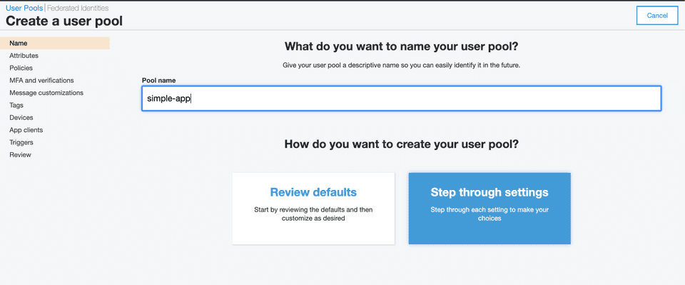
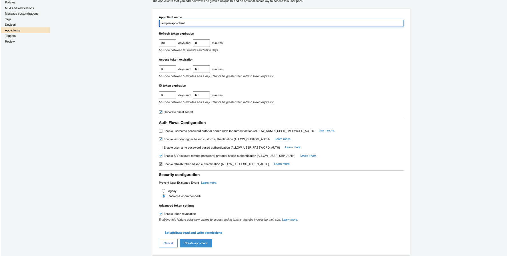
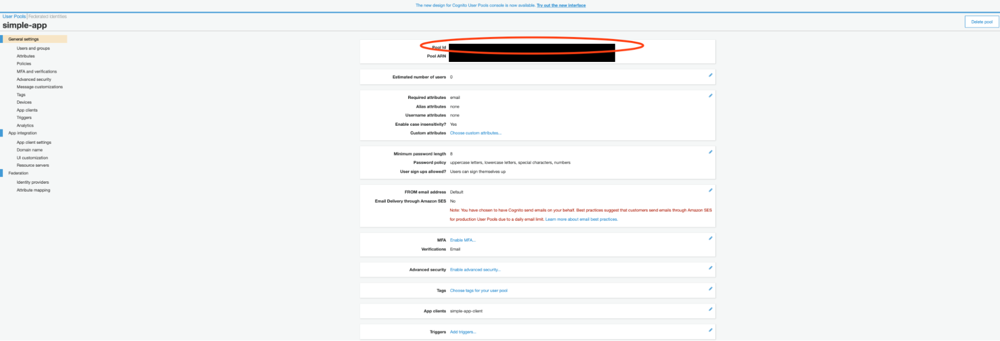
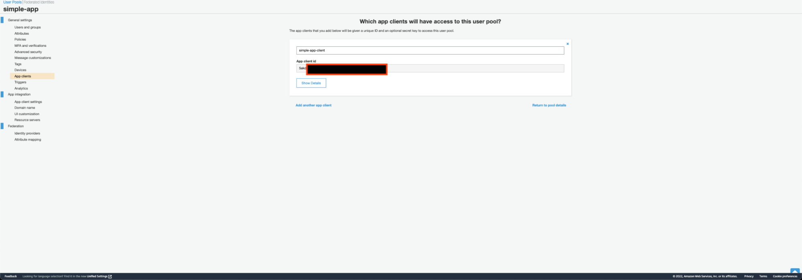
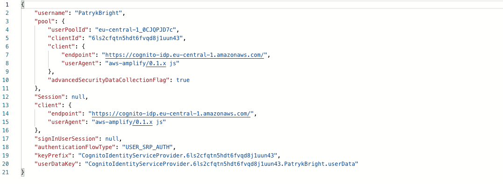
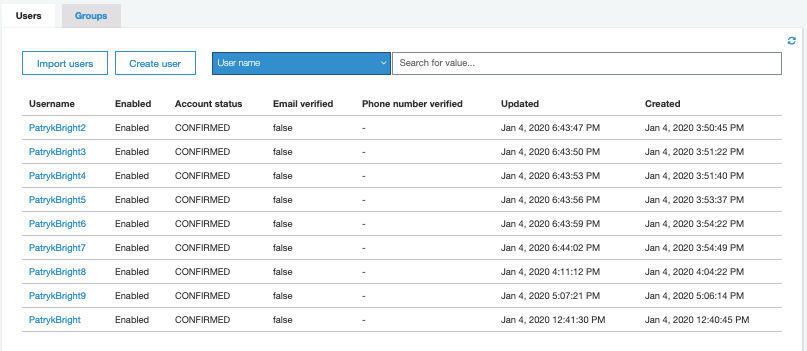
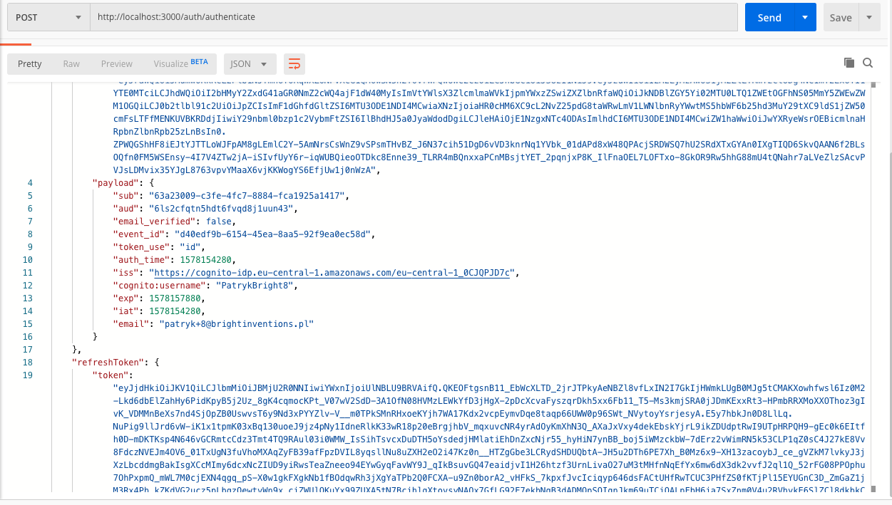

**AWS Cognito simplified the authentication, authorization and user management for you. In this post I will try to present how we can use this authentication service with your mobile app, website, and manage users.**

[Download repository with Nestjs AWS Cognito example](https://github.com/bright/nestjs-aws-cognito) 

## Initial work

To get started with AWS Cognito we need to create a user pool. The user pool is a container that AWS Cognito uses to manage and hold users identify.\
\
 In my case I don’t have any user pools, so I’m going to create one.

<div className="image"></div>

Here you are given two options to select from, let's select *Review defaults*. Make sure to provide a pool name as well.

Next, we need to create an app client. The app client is the client that our NestJS server will be communicating with. Make sure to tick Enable sign-in API for server-based authentication for our NodeJS server access Cognito user pool for authentication. App clients can be created after the generation of user pools as well. So, if you forget to add an app client when the creation of the user pool - do not worry, you can create a new one again.

<div className="image"></div>

We leave  `Generate client secret` unchecked as it is required for library we will use. Per `amazon-cognito-identity-js` documentation:

<div class="important-info"><div>When creating the App, the generate client secret box must be unchecked because the JavaScript SDK doesn't support apps that have a client secret.</div></div>

After successfully creating Pool and Client, copy `Pool Id` and `App Client Id` as we will need it for configuration.

<div className="image"></div>

*Pool Id*

<div className="image"></div>

*App Client Id*

## Creating TypeScript NestJS Server

Ok, once we have completed the first part of the post which was creating a User Pool in Amazon Cognito, we can switch to creating the NestJS server which will use the Amazon Cognito user pool to authenticate users.

The easiest way to set up the environment is to run commands to initialize the Nest app and allow us to install the required packages.

I describe using npm to install packages, including the Nest CLI. Install the CLI globally using the `npm install -g` command (see the note above for details about global installs).

So, we are adding the Nest CLI package globally:

```text
npm install -g @nestjs/cli
```

To create, build and run a new basic Nest project in the development mode, go to the folder that should be the parent of your new project, and run the following commands:

```text
nest new simple-app
cd simple-app
npm run start:dev
```

In your browser open `http://localhost:3000` to see a new application running. The app will automatically recompile and reload when you change any of the source files.

## Implement authentication

We are going to implement three functions in our NodeJS server application that authenticate the user:

* Sign in
* Sign up
* Token Validation (bonus, as an Authentication middleware)
  For each function we will need separate API endpoints in our server as well. Let’s create an `auth.controller` to handle incoming requests.

For that purpose we are going to use *NestCLI* to generate the `auth.module`, `auth.controller` and `auth.service`.

```text
nest generate module auth
nest generate controller auth
nest generate service auth
```

The Nest CLI automatically will generate the auth folder with files and add it to the existing app module.

The next step is to add a package to help us reach the Cognito SDK which will be going to be used for requests to Cognito API

`npm install amazon-cognito-identity-js --save`

Let's start by implementing `auth.service.ts`

```typescript
import { Injectable } from '@nestjs/common';
import {
  AuthenticationDetails,
  CognitoUser,
  CognitoUserAttribute,
  CognitoUserPool,
} from 'amazon-cognito-identity-js';
import { ConfigService } from '@nestjs/config';
import { RegisterRequestDto } from './dto/register.request.dto';
import { AuthenticateRequestDto } from './dto/authenticate.request.dto';

@Injectable()
export class AuthService {
  private userPool: CognitoUserPool;

  constructor(private configService: ConfigService) {
    this.userPool = new CognitoUserPool({
      UserPoolId: this.configService.get<string>('AWS_COGNITO_USER_POOL_ID'),
      ClientId: this.configService.get<string>('AWS_COGNITO_CLIENT_ID'),
    });
  }

  async register(authRegisterRequest: RegisterRequestDto) {
    const { name, email, password } = authRegisterRequest;
    return new Promise((resolve, reject) => {
      return this.userPool.signUp(
        name,
        password,
        [new CognitoUserAttribute({ Name: 'email', Value: email })],
        null,
        (err, result) => {
          if (!result) {
            reject(err);
          } else {
            resolve(result.user);
          }
        },
      );
    });
  }

  async authenticate(user: AuthenticateRequestDto) {
    const { name, password } = user;
    const authenticationDetails = new AuthenticationDetails({
      Username: name,
      Password: password,
    });
    const userData = {
      Username: name,
      Pool: this.userPool,
    };
    const newUser = new CognitoUser(userData);
    return new Promise((resolve, reject) => {
      return newUser.authenticateUser(authenticationDetails, {
        onSuccess: (result) => {
          resolve(result);
        },
        onFailure: (err) => {
          reject(err);
        },
      });
    });
  }
}
```

Let's now import the following functions in our `auth.controller` which will receive the request and handle it.

```typescript
import { BadRequestException, Body, Controller, Post } from '@nestjs/common';
import { AuthService } from './auth.service';
import { AuthenticateRequestDto } from './dto/authenticate.request.dto';
import { RegisterRequestDto } from './dto/register.request.dto';

@Controller('auth')
export class AuthController {
  constructor(private readonly authService: AuthService) {}

  @Post('register')
  async register(@Body() registerRequest: RegisterRequestDto) {
    try {
      return await this.authService.register(registerRequest);
    } catch (e) {
      throw new BadRequestException(e.message);
    }
  }
  @Post('authenticate')
  async authenticate(@Body() authenticateRequest: AuthenticateRequestDto) {
    try {
      return await this.authService.authenticate(authenticateRequest);
    } catch (e) {
      throw new BadRequestException(e.message);
    }
  }
}
```

I have added two endpoints:

* register - API endpoint to register user
* authenticate - API endpoint to authenticate user 

###### Please note that in Cognito we add requirements according to which password should have at least 8 characters, in my example, I have added some validation at the dto level.

Our Dto's interface declaration looks like:

`register.request.dto.ts`

```typescript
import { IsEmail, IsString, Matches, MinLength } from 'class-validator';

export class RegisterRequestDto {
  @IsString()
  name: string;

  @IsEmail()
  email: string;

  @IsString()
  @MinLength(8)
  @Matches(/[a-z]/)
  @Matches(/[A-Z]/)
  @Matches(/[0-9]/)
  password: string;
}
```

`authenticate.request.dto.ts`

```typescript
import { IsString } from 'class-validator';

export class AuthenticateRequestDto {
  @IsString()
  name: string;

  @IsString()
  password: string;
}
```

## Bonus: Token Validation

For token validation we are going to use extra features from *NestJS*. For this purpose we are using *Guards*. 

We are going to start from install required packages:

```text
npm i --save @nestjs/jwt @nestjs/passport passport passport-jwt jwks-rsa
```

The following code extends the `PassportStrategy` package and grabs the Bearer token from the headers and pass it to the function validate. We use `jwks-rsa` to confirm a token with JWKS signing from AWS.

```typescript
import { ExtractJwt, Strategy } from 'passport-jwt';
import { PassportStrategy } from '@nestjs/passport';
import { Injectable } from '@nestjs/common';
import { ConfigService } from '@nestjs/config';
import { passportJwtSecret } from 'jwks-rsa';

@Injectable()
export class JwtStrategy extends PassportStrategy(Strategy) {
  constructor(private readonly configService: ConfigService) {
    super({
      secretOrKeyProvider: passportJwtSecret({
        cache: true,
        rateLimit: true,
        jwksRequestsPerMinute: 3,
        jwksUri: `https://cognito-idp.${configService.get(
          'AWS_REGION',
        )}.amazonaws.com/${configService.get(
          'AWS_COGNITO_USER_POOL_ID',
        )}/.well-known/jwks.json`,
      }),

      jwtFromRequest: ExtractJwt.fromAuthHeaderAsBearerToken(),
      audience: configService.get('AWS_COGNITO_CLIENT_ID'),
      issuer: `https://cognito-idp.${configService.get(
        'AWS_REGION',
      )}.amazonaws.com/${configService.get('AWS_COGNITO_USER_POOL_ID')}`,
      algorithms: ['RS256'],
    });
  }

  public async validate(payload: any) {
    return !!payload.email;
  }
}
```

In case you want to check the decoded jwt you can check [this](https://jwt.io/) out. More about verifying JWT in Cognito User Pool you can find [here.](https://docs.aws.amazon.com/cognito/latest/developerguide/amazon-cognito-user-pools-using-tokens-verifying-a-jwt.html)

When you want to use the *Authentication Guard*. Guards have a single responsibility. They determine whether a given request will be handled by the route handler or not, depending on certain conditions (like permissions, roles, ACLs, etc.) present at run-time. This is often referred to as authorization. Authorization (and its cousin, authentication, with which it usually collaborates) has typically been handled by middleware in traditional Express applications. Middleware is a fine choice for authentication, since things like token validation and attaching properties to the request object are not strongly connected with a particular route context (and its metadata).

We need to use [AuthGuard](https://docs.nestjs.com/guards) and use Decorator *@UseGuards(AuthGuard)*. More about decorators you can find [here](https://docs.nestjs.com/custom-decorators). [](https://docs.aws.amazon.com/cognito/latest/developerguide/amazon-cognito-user-pools-using-tokens-verifying-a-jwt.html)For that we created simple “alias” for our JWT Auth Guard:

`jwt.guard.ts`

```typescript
import { Injectable } from '@nestjs/common';
import { AuthGuard } from '@nestjs/passport';

@Injectable()
export default class JwtAuthenticationGuard extends AuthGuard('jwt') {}
```

## It’s showtime!

The above code is a minimalistic version for NestJS authentication using Cognito User Pools. Now it's time for doing some tests.

### 1. Register

I used *Postman* to send the request. In *@Body* I included email, password, name. A created successful response will contain:



Then we can check also in our app in Cognito that the User has been created:



### 2. Authenticate

Again, in @Body I sent the required password and the user field. If I prepare the correct data, I will receive the user payload:



### 3. Validation

For the test purposes I have added the *Guard* for the demo route. If I don't include the *Authorization* header with a token, the server will throw `UnauthorizedException` and in the client I will receive:

```json
{
    "statusCode": 401,
    "error": "Unauthorized"
}
```

When we add in a proper format the token `bearer {token}` (notice that `ExtractJwt.fromAuthHeaderAsBearerToken()`  expects **bearer** not **Bearer**) the Guard which will determine that the token is valid or not, and will allow the route to handle the request.

## Summary

I think that more and more developers will use the IaaS (infrastructure as a service) and move logic outside the backend. What is great, in AWS you can also move all the logic with verifying the JWT to *LAMBDA* which can be triggered before sign-up and authentication (we can customize these workflows in the user pool settings).

Cognito is a great service from AWS. I use it always when I have an opportunity to do it.

[Full repository with code you can find on our Github.](https://github.com/bright/nestjs-aws-cognito/)

<div className='block-button'><h2>We are looking for backend developers (TS, Node.js)</h2><div>Join our team and work on projects such as the Ethereum blockchain platform, accounting software, or web therapy applications.</div><a href="/jobs/senior-backend-developer-typescript"><button>Apply and join our team</button></a></div>

- - -

The article was written by Patryk Huzarski in 2020 and later updated by Wojciech Kałębasiak.
