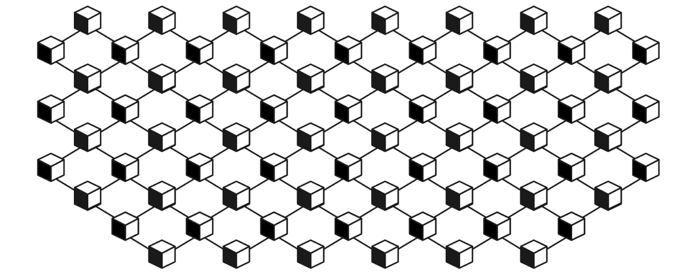

**Substrate is an SDK that enables you to build your blockchain from previously built components. Do you want to be a blockchain developer? Thanks to Substrate, joining the blockchain development community has never been easier. Find out why!**

## Substrate is the fastest way to build blockchain

You can easily have a blockchain node developed within an hour! If you find that hard to believe, check out a 1-hour [tutorial that enables you to launch Substrate Node on your computer](https://substrate.dev/docs/en/tutorials/create-your-first-substrate-chain/).

What is more, Substrate as a blockchain framework does all the hard job for you. You do not have to worry about the core components: data layer, networking, transaction queue and consensus. In the beginning you can just use the default ones and start playing with your new blockchain! As you get more involved you can exchange components, but still do not have to worry about implementing them – just use a pallet that suits your needs.

## Substrate is a young framework but more mature than you think

Obviously Substrate, which was released in 2018, is younger compared to Ethereum or Bitcoin. However, since then it has been successfully used to develop products. Here you will find [over 150 projects which are built on Substrate](https://substrate.io/ecosystem/projects/). You can easily find examples of DeFi, Smart Contracts, IoT or Gaming projects.

## It is more flexible than other blockchains networks

Building Substrate gives you the freedom to use custom blocks as you want or develop your own ones. **You do not have to build smart contracts**, but you can if you want. 🙂  Instead of building smart contracts, you can create your own functions ensuring the safety of your network. Of course, in that case it is your full responsibility to deliver proper functions. Yet, you can modify them whenever you want with the onchain upgrade mechanism. As you probably know – in Ethereum once you create smart contracts, there is no easy way back. You can’t change them, you have to deploy a new smart contract, which practically means to start from the beginning.

## Substrate offers a great solution to integrate your apps with blockchain

**At Bright Inventions we specialise in integrating blockchain data with web systems.** For the [BrightTreasury](/projects/bright-treasury/) project we integrate web applications with Substrate. Our experience shows that integration with this framework is much easier thanks to the JS API that has been developed simultaneously with the whole framework. The other really interesting project is a light blockchain client, which you can easily include right into your web app and interact with the network directly. This is a big step forward to fully decentralized user-friendly applications.

## If you want to become a blockchain developer choosing Substrate is the fastest way

Substrate is written in Rust and that itself is really great news for many developers. **Rust is quite similar to JavaScript in how you write the code but its logic might be compared to C++.** Therefore even if you only know JS, you will easily move to Rust. It is worth mentioning that Rust might be similar to C++ but only in a good way. Rust is quick as it does not have any runtime or garbage collector. However, due to its type system and ownership model it prevents memory errors right in the compile time. It also includes all the goodies that modern languages have: an advanced compiler with robust error descriptions, a package manager and build tools. Simply saying Rust is younger, faster and modern so there is no surprise that this is one of the top wanted languages according to the [2021 Stack Overflow Developer Survey](https://insights.stackoverflow.com/survey/2021#most-loved-dreaded-and-wanted-language-want).

Besides, if you want to be a blockchain developer knowing Rust is one thing, the other one is understanding the idea behind blockchain. That is the homework you need to do well before you dive into coding. 😉

Do you want to know more about developing blockchain? Check out our tutorial about [developing cryptocurrency with Substrate](/blog/erc20-substrate-nest-example/).

Or maybe you want to build your own [Substrate blockchain solution?](/our-areas/blockchain)

<h2>Are you looking for Substrate experts?</h2>
We specialize in integrating web and mobile apps with blockchain solutions. Our team works closely with Polkadot and Kusama nets. Contact us to estimate your Substrate Blockchain solution.
<a href="/start-project"><button>Let's talk about your product</button></a>

