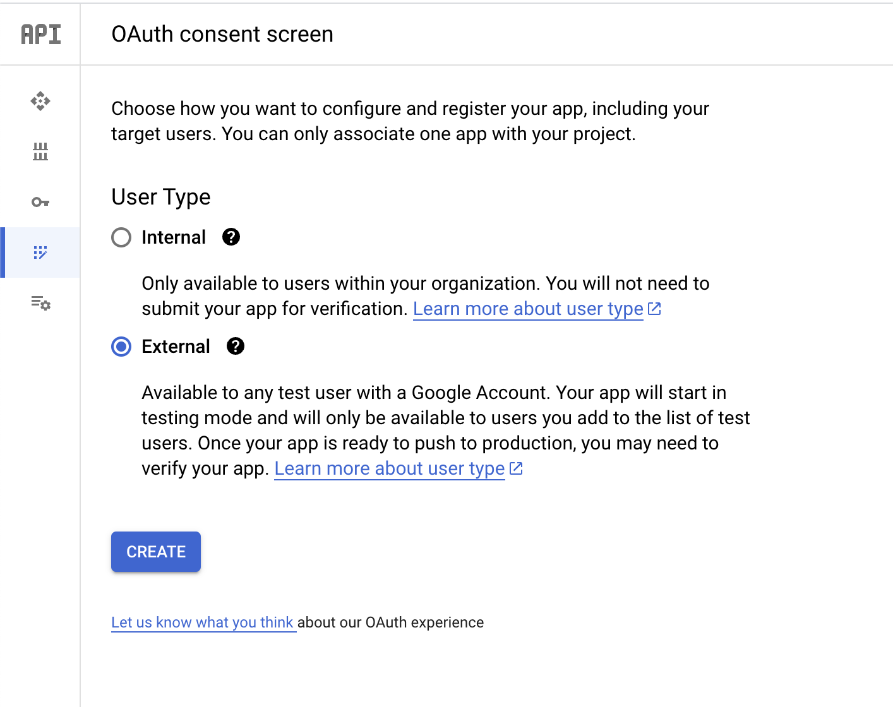
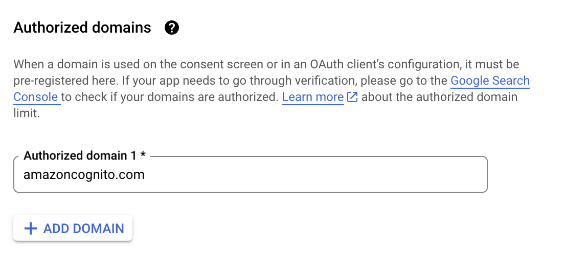
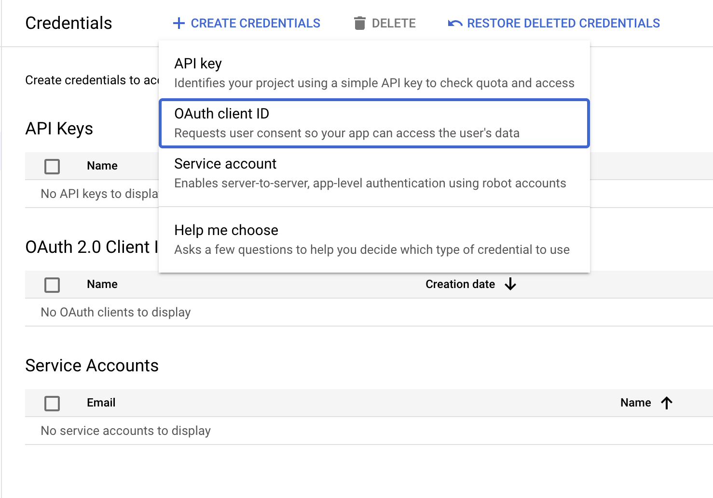
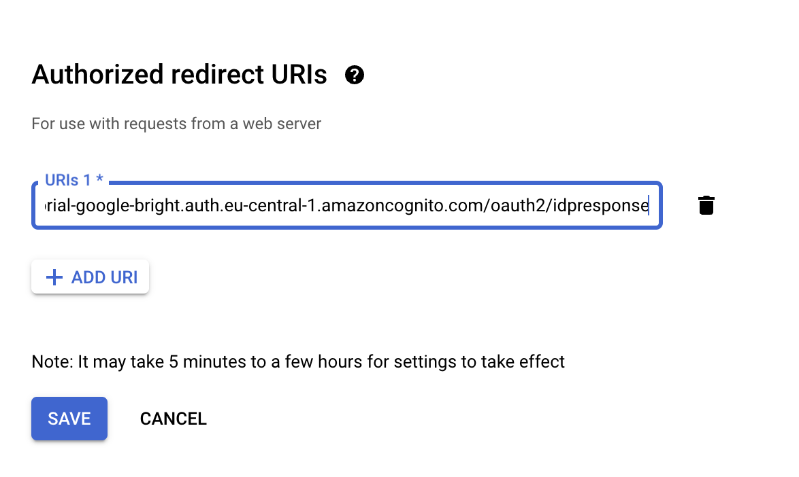

If you want to implement Google sign-in, also called Google federation, and combine it with using AWS Cognito this blog
post if for you.
We'll use aws-cdk combined with Nest.js to achieve that.

## Setup

At Bright, we often keep infrastructure code next to application code.
Thus let's start with creating:

* Nest.js backend project

```shell
nest new backend
```

* aws-cdk infrastructure project

```shell
mkdir infrastrucutre
(cd infrastrucutre && npx cdk@2 init --language=typescript)
```

## Cognito UserPool

Cognito `UserPool` represents our users' directory. You can think of it as the repository of of user accounts.

```typescript
export class CognitoGoogleAuthNestJs extends Stack {
  constructor(scope: Construct, id: string, props?: StackProps) {
    super(scope, id, props);

    const userPool = new UserPool(this, 'users', {
      selfSignUpEnabled: true,
      signInAliases: { email: true }
    });

    const userPoolDomain = userPool.addDomain('backend', {
      cognitoDomain: {
        domainPrefix: "tutorial-bright"
      }
    });

    new CfnOutput(this, 'user-pool-domain-uri', {
      value: userPoolDomain.baseUrl()
    })
  }
}
```

## Setup Google API credentials

We need to enable Cognito to talk with Google APIs.
In our Google Cloud Platform project, let's enable OAuth consent screen:



Next configure application name and a domain of the oauth handling endpoints. AWS Cognito provides us with
those [endpoints](https://docs.aws.amazon.com/cognito/latest/developerguide/federation-endpoints.html):



Remember that until your application is published, you can only use it with test users.
You'll be able to add test users while configuring OAuth consent screen.

Finally, create an oauth client id using the web application type:


Finally, you need to configure Authorized redirect URIs to point to
AWS Cognito IDP response [endpoint](https://docs.aws.amazon.com/cognito/latest/developerguide/federation-endpoints.html)
that will be in the form of: `https://${domainPrefix}.auth.${region}.amazoncognito.com/oauth2/idpresponse`



Download the oauth client credentials JSON file. We should not store the client credentials in our source code.
Let's use AWS Secret Manager for that:

```shell
 aws secretsmanager create-secret \
  --name cognito-google-oauth-credentials \
  --secret-string "$(jq '.web' < ~/Downloads/client_secret.apps.googleusercontent.com.json)"
```

The `jq '.web' ...` extract the nested `web` attribute content. This is required as you can't reference nested values in
AWS Secret Manager.

## Configure OAuth clients

We need to instruct Cognito to be able to communicate with Google as the Identity Provider:

```typescript
const clientCredentials = Secret.fromSecretNameV2(this, 'google-client-credentials', 'cognito-google-oauth-credentials')

userPool.registerIdentityProvider(new UserPoolIdentityProviderGoogle(this, "Google", {
  userPool,
  clientId: clientCredentials.secretValueFromJson("client_id").unsafeUnwrap(),
  clientSecret: clientCredentials.secretValueFromJson("client_secret").unsafeUnwrap(),

  // Email scope is required, otherwise we'll not get it
  scopes: ["email"],
  attributeMapping: {
    email: ProviderAttribute.GOOGLE_EMAIL,
  },
}));
```

Finally, we need to tell Cognito where to take the end user for after authentication. The callback url will be the url
of our Nest.js backend.

```typescript
const hostedZone = HostedZone.fromLookup(this, 'tutorial.bright.dev', {
  domainName: 'tutorial.bright.dev'
});

const baseNestJsUrl = new URL(`https://nestj-google-cognito.${hostedZone.zoneName}`);

const callbackUrl = new URL("/auth/callback", baseNestJsUrl)

const userPoolClient = userPool.addClient('nest.js', {
  generateSecret: true,
  supportedIdentityProviders: [UserPoolClientIdentityProvider.GOOGLE],
  oAuth: {
    callbackUrls: [callbackUrl],
  },
});
// workaround for https://github.com/aws/aws-cdk/issues/15692
userPoolClient.node.addDependency(identityProviderGoogle)
```

## Handle Cognito sign-in callback in Nest.js

After Cognito federates with Google OpenId Connect Provider, it passes the control to our application.
In essence, it is the [Authorization code grant with PKCE](https://datatracker.ietf.org/doc/html/rfc7636).
Our application will receive a `code` that it has to exchange for Access Token, Id Token and Refresh Token using Cognito
APIs.

If your backend should automatically redirect unauthenticated API clients to OAuth authorize endpoint, then
use [passport-oauth2](https://www.passportjs.org/packages/passport-oauth2/).
To make our example more transparent, we invoke the token endpoint manually:

```typescript
@Controller()
export class AuthController {
  constructor(private readonly configService: ConfigService<OAuthClientEnvConfiguration>) {
  }

  @Get("/auth/callback")
  async signIn(@Query('code') authorizationCode: string) {
    const clientId = this.configService.getOrThrow('OAUTH_CLIENT_ID')
    const clientSecret = this.configService.getOrThrow('OAUTH_CLIENT_SECRET')
    const authorizationEncoded = Buffer.from(`${clientId}:${clientSecret}`).toString("base64");

    const authParams = new URLSearchParams(Object.entries({
      client_id: clientId,
      code: authorizationCode,
      grant_type: "authorization_code",
      redirect_uri: this.configService.getOrThrow('OAUTH_CALLBACK_URL'),
    }));

    const tokenUrl = `${this.configService.getOrThrow('OAUTH_AUTHORIZATION_SERVER_URL')}/oauth2/token?` + authParams;

    const tokenData = await (await fetch(tokenUrl, {
      method: 'POST',
      headers: {
        Authorization: `Basic ${authorizationEncoded}`,
        "Content-Type": "application/x-www-form-urlencoded",
      },
    })).json();
    // tokenData has id_token, access_token and refresh_token
  }
}
```

At the end of the sign-in flow our application we have `IdToken`, `AccessToken` and `RefreshToken`.
What we do at this stage depends on our needs. For example, we can:

* start a cookie-based session
* return `AccessToken` to frontend
* init user account configuration that do not fit into AWS Cognito

## Combine Cognito with Passport Nest.js

Passport is often used in Node.js backends to deal with authentication.
The [passport-oauth2](https://www.passportjs.org/packages/passport-oauth2/) extension provides an easy way to integrate
with standard OAuth flows. Here's how to use it in Nest.js:

```typescript
@Controller()
export class AuthController {
  constructor(private readonly configService: ConfigService<OAuthClientEnvConfiguration>) {
  }

  @UseGuards(AuthGuard('oauth'))
  @Get("/auth/callback")
  async signInPassport(@Req() req: Express.AuthenticatedRequest) {
    // req.user has id_token, access_token and refresh_token 
  }

}

// register in AppModule
@Injectable()
export class NestPassportOAuthStrategy extends PassportStrategy(OAuth2Strategy) {
  constructor(configService: ConfigService<OAuthClientEnvConfiguration>) {
    super({
      clientID: configService.getOrThrow('OAUTH_CLIENT_ID'),
      clientSecret: configService.getOrThrow('OAUTH_CLIENT_SECRET'),
      authorizationURL: `${configService.getOrThrow('OAUTH_AUTHORIZATION_SERVER_URL')}/oauth2/authorize`,
      tokenURL: `${configService.getOrThrow('OAUTH_AUTHORIZATION_SERVER_URL')}/oauth2/token`,
      callbackURL: configService.getOrThrow('OAUTH_CALLBACK_URL')
    } as OAuth2Strategy.StrategyOptions, (accessToken, refreshToken, results, profile, verified) => {
      console.log('verified', { accessToken, refreshToken, results, profile, verified })
    });
  }
}
```

## Provide users with login URL

With AWS Cognito we can use hosted pages. However, we often need to have a full control over the UI of our
application.\
In such a case, we can craft a special URL that will trigger the sign in flow. Here's how to create the URL that will
trigger login with Google flow:

```typescript
const baseAuthUrl = this.configService.getOrThrow('OAUTH_AUTHORIZATION_SERVER_URL')
const clientId = this.configService.getOrThrow('OAUTH_CLIENT_ID')
const loginViaGoogleUrl = `${baseAuthUrl}/oauth2/authorize?${new URLSearchParams(Object.entries({
  client_id: clientId,
  identity_provider: 'Google',
  response_type: 'code',
  redirect_uri: this.configService.getOrThrow('OAUTH_CALLBACK_URL')
}))}`
```

The URL will look as follows:

```text
https://{cognitoDomainPrefix}.auth.{awsRegion}.amazoncognito.com/oauth2/authorize?client_id={cognitoClientId}&identity_provider=Google&response_type=code&redirect_uri={yourApplicationCallbackUrl}
```

Please bear in mind that the `client_id` parameter is one retrieved from `userPoolClient` and not from Google project
API credentials.

## ECS Task Definition

I'll spare you the details on how to run the Nest.js application in ECS. That's a topic for a separate blog post.\
However, there are a couple of important configuration options that you need to provide for the above snippets to work:

```typescript
 const backend = task.addContainer('backend', {
  image: ContainerImage.fromDockerImageAsset(new DockerImageAsset(this, 'backend-image', {
    directory: path.join(process.cwd(), '..', 'backend')
  })),
  environment: {
    PORT: '3000',
    OAUTH_CLIENT_ID: userPoolClient.userPoolClientId,
    OAUTH_CLIENT_SECRET: userPoolClient.userPoolClientSecret.unsafeUnwrap(),
    OAUTH_AUTHORIZATION_SERVER_URL: userPoolDomain.baseUrl(),
    OAUTH_CALLBACK_URL: callbackUrl.toString(),
  },
  portMappings: [{ containerPort: 3000 }],
  logging: LogDriver.awsLogs({
    streamPrefix: "backend",
    logGroup: logGroup
  })
});
```

## Summary

The full code of the above setup is available in [GitHub](https://github.com/bright/bright-cognito-google-nest/).
In our example, AWS Cognito performs OpenID Connect exchange with Google. Our Nest.js application code only receives
information from Cognito. We can easily integrate new identity providers e.g. Facebook and our backend application code
would still work. 

<EbookDynamic sectionTitle='Optimise sign-in experience of your app' ebookName='Optimise-Sign-In-Experience.pdf' ebookDescription='Download our free ebook and explore the best authentication methods.' ebookImage='/images/cover-sign-in-ebook.png' ebookAlt='ebook cover' />