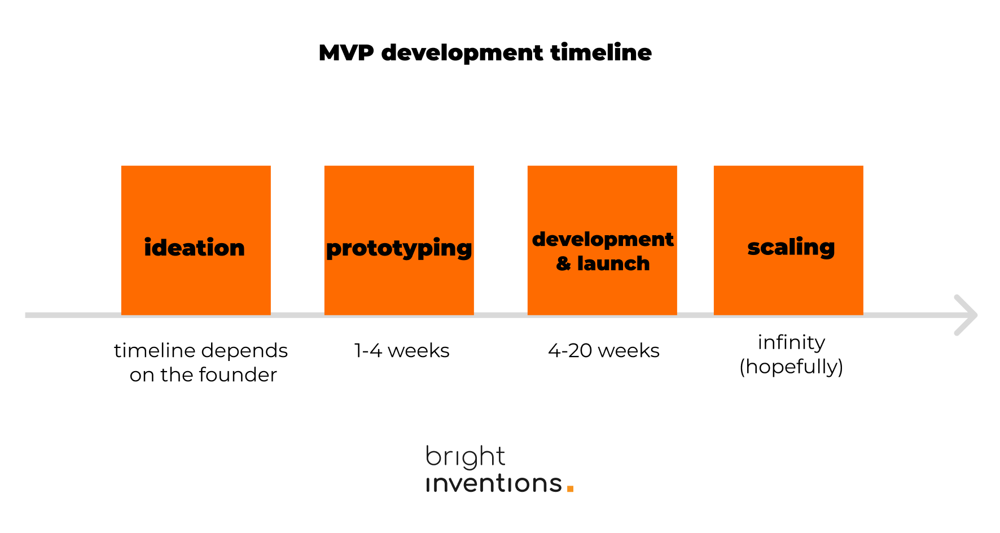
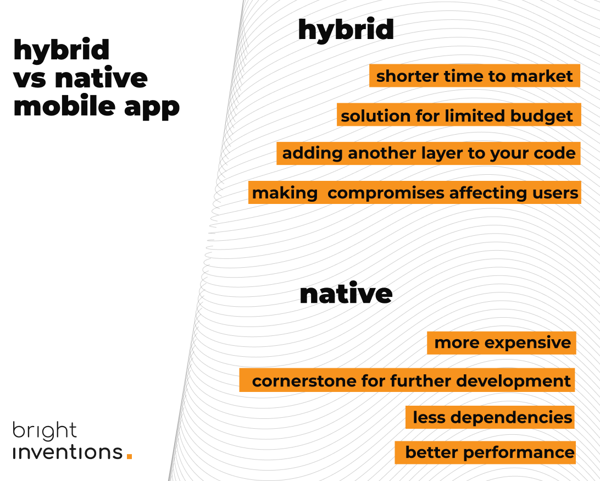

**Before you start building the MVP for your FemTech solution, there are several key areas you should be familiar with. In this guide, we'll cover the technical challenges, the technology stack, and security practices essential for planning your MVP journey.**

There are several key technological aspects of FemTech that could significantly influence the success of your product. We delve deeply into FemTech in another one of our blog posts, which you are encouraged to explore here: [Understanding FemTech: Keys to Succeed with Your Software Solution for Women](/blog/keys-to-succeed-in-femtech/). 

However, in this article, we focus exclusively on [the development of a Minimum Viable Product (MVP)](/our-areas/mvp-development/), which is also a critical component of the software development process, especially in the context of FemTech.

## Benefits of MVP development in FemTech

### The fastest way to validate your idea is through MVP development

Even with thorough user research and product workshops, pre-launch stages are mostly based on assumptions. An MVP will provide definitive feedback on whether your idea merits further investment of money and resources.

### Less financial risk

Launching the first version of your solution cost-effectively—an MVP includes only essential features that offer unique value. This allows for a smaller investment and minimizes the potential financial risks associated with every MVP development.

### A first step towards scaling

A well-executed MVP should serve as a solid foundation for future enhancements.

## MVP development process and timeline

Every MVP development process is different, but we listed the typical MVP phases:

### Ideation

Perhaps it all begins with an idea, but the real work is just getting started. This is the time to assess the business potential of the idea, establish buyer personas, and identify market challengers. One of the most effective ways to do this is through [product workshops](/our-areas/product-workshops/), preferably conducted by a company that specializes in delivering MVPs for specific sectors.

Do you plan to better understand your buyer persona? Check out the free [ICP + B2B Buyer Persona Workshop](https://miro.com/miroverse/b2b-buyer-persona-workshop-template/) template made by our team.

### Prototyping (1-4 weeks)

This is the moment to visualize the idea, often in the form of basic clickable mockups. This stage helps every member of the development process – both business and technological sides – to ensure they are on the same page. It also enables the elimination of initial mistakes in the UI.

### Development and launch the MVP (4-20 weeks)

The moment when the software team, whether in-house or outsourced, can develop the solution according to the plan, preferably in 2-week sprints. The MVP should showcase the key features but shouldn't be too advanced, allowing the development process to realistically last up to 20 months.

### Scaling (Infinity – hopefully)

The post-MVP phase can be a critical moment for your FemTech startup. Finding the balance between delivering new features, as well as building credibility with a reliable and secure solution, is essential. Development and maintenance are crucial, and the rising number of users, which is indeed something to celebrate, might cause performance issues that every successful post-MVP product has to face at some point. Therefore, performance monitoring, adhering to security best practices, and a strong QA approach might be key to success. Along with a marketing campaign, of course.

## MVP stack to choose for your FemTech solution

**Web development**: JavaScript/TypeScript, React

**Mobile development**: Swift (iOS), Kotlin (Android)

**Hybrid mobile app development**: React Native, TypeScript, mobx-state-tree

**Cloud development**: Amazon Web Services (AWS) / Microsoft Azure / Google Cloud, JavaScript/TypeScript, Node.js/NestJS

## Examples of technologies and best practices to implement in FemTech

### IoT with healthcare smart wearables enabling telemedicine and remote patient monitoring

Femtech wearables offer numerous opportunities to support female patients on a daily basis. These devices range from those that assist with menstrual and fertility monitoring to cooling bracelets designed for women experiencing menopause, marking a new era for FemTech through wearables and the Internet of Things (IoT).

The Internet of Things enables the connection of all devices with dedicated applications, allowing data collected by these devices to be quickly processed and verified by doctors. This significantly reduces the time required for diagnosis.

[Read more about examples of IoT implementation](/blog/examples-of-the-internet-of-things-for-retail-healthcare-and-more-with-case-studies/).

### Data analytics & performance monitoring

Before launching your MVP, consider setting up even a basic app performance monitoring system to ensure your solution operates as intended and to proactively prevent any potential performance issues. This is particularly crucial in the post-MVP phase when your solution begins to attract more users, which will serve as the real test of your infrastructure.

Find out [how to set up app performance monitoring](/blog/healthcare-app-performance-monitoring/) with our tutorial.

### Security practices

Securing your patients' data should always be a priority, even during MVP development. You can then start a proper secure software development cycle, incorporating all recommended security strategies and tools. In another blog post, [we've listed security practices you need to implement to build a secure and trustworthy solution](/blog/cyber-security-in-healthcare/). 

## Key technology decisions to make at the MVP stage

### Native or hybrid mobile applications

Building one hybrid solution for both app stores or a separate dedicated apps for Google Play and App Store? That is the question every mobile MVP owner has to face.

We cover deeply the subject of [hybrid vs native mobile apps](/blog/mvp-tech-stack-what-startup-founder-should-know/#hybrid-or-native-mobile-app-that-is-the-question) in another article.

### Choosing a cloud provider

Cloud computing is crucial for medial data storage. In terms of cloud providers, you should choose the one your team is the most familiar with.

<blockquote><h2>Software engineer's perspective</h2>
It is like driving on the left side of the street in England or Australia. It is just how they learned so they do it that way. At Bright Inventions we started with AWS so we stuck to it. I do not think that it would make a great technical difference if we used Azure or other cloud services instead of AWS. Looking from a business perspective it does not matter as well.
<footer>Piotr Mionskowski, Head of Technology & Partner @bright inventions</footer></blockquote>

### Implementing multi-module apps for Android

Multi-module Android development represents a contemporary approach to structuring the architecture of Android applications. Unlike traditional, monolithic codebases, multi-module apps feature separated units of code within distinct modules. This structure enhances clarity, customization, and, consequently, the scalability of your Android solution. If you plan to develop an Android MVP, considering a multi-module solution is advisable.

My colleague, an experienced Android developer dives into multi-module apps in another blog post, feel free to check it out: [Multi-Module Android Application – Why You Should Choose It for Your Business.](/blog/multi-module-android-app-why-you-should-choose-it-for-your-business/)

## Example of a successful FemTech MVP launch

Read [the story of the app for pregnant women](/projects/pregnancy-app/) that was successfully released as MVP in Germany.

## What comes after the MVP launch?

Launching an MVP in conjunction with a marketing campaign provides the ultimate validation of your idea. If the MVP attracts users, you can proceed with further iterations, gradually adding new features and proactively preparing for scaling. In some instances, the MVP may reveal that the application needs to pivot.

Pivots aren’t something new in software development. You can read an inspiring [example of pivots by a HealthTech company – Decorte Future Industries](/blog/the-intriguing-tale-of-decorte-future-industries/).