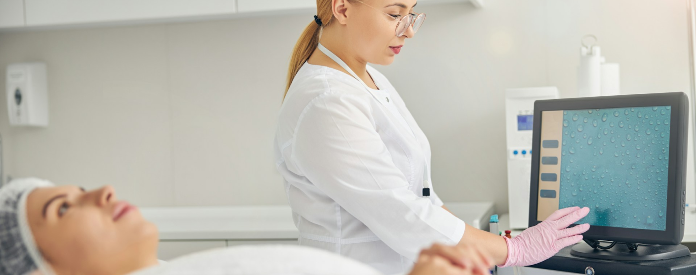

**Before you start building the MVP for your FemTech solution, there are several key areas you should be familiar with. In this guide, we'll cover the technical challenges, the technology stack, and security practices essential for planning your MVP journey.**

There are several key technological aspects of FemTech that could significantly influence the success of your product. We delve deeply into FemTech in another one of our blog posts, which you are encouraged to explore here: [Understanding FemTech: Keys to Succeed with Your Software Solution for Women](/blog/keys-to-succeed-in-femtech/). 

However, in this article, we focus exclusively on [the development of a Minimum Viable Product (MVP)](/our-areas/mvp-development/), which is also a critical component of the software development process, especially in the context of FemTech.

## Benefits of MVP development in FemTech

### The fastest way to validate your idea is through MVP development

Even with thorough user research and product workshops, pre-launch stages are mostly based on assumptions. An MVP will provide definitive feedback on whether your idea merits further investment of money and resources.

### Less financial risk

Launching the first version of your solution cost-effectively—an MVP includes only essential features that offer unique value. This allows for a smaller investment and minimizes the potential financial risks associated with every MVP development.

### A first step towards scaling

A well-executed MVP should serve as a solid foundation for future enhancements.

## MVP development process and timeline

Every MVP development process is different, but we listed the typical MVP phases:

### Ideation

Perhaps it all begins with an idea, but the real work is just getting started. This is the time to assess the business potential of the idea, establish buyer personas, and identify market challengers. One of the most effective ways to do this is through [product workshops](/our-areas/product-workshops/), preferably conducted by a company that specializes in delivering MVPs for specific sectors.

Do you plan to better understand your buyer persona? Check out the free [ICP + B2B Buyer Persona Workshop](https://miro.com/miroverse/b2b-buyer-persona-workshop-template/) template made by our team.

Prototyping (1-4 weeks)

This is the moment to visualize the idea, often in the form of basic clickable mockups. This stage helps every member of the development process—both business and technological sides—to ensure they are on the same page. It also enables the elimination of initial mistakes in the UI.

Development and launch the MVP (4-20 weeks)

The moment when the software team, whether in-house or outsourced, can develop the solution according to the plan, preferably in 2-week sprints. The MVP should showcase the key features but shouldn't be too advanced, allowing the development process to realistically last up to 20 months.

Scaling (Infinity – hopefully)

The post-MVP phase can be a critical moment for your FemTech startup. Finding the balance between delivering new features, as well as building credibility with a reliable and secure solution, is essential. Development and maintenance are crucial, and the rising number of users, which is indeed something to celebrate, might cause performance issues that every successful post-MVP product has to face at some point. Therefore, performance monitoring, adhering to security best practices, and a strong QA approach might be key to success. Along with a marketing campaign, of course. :)