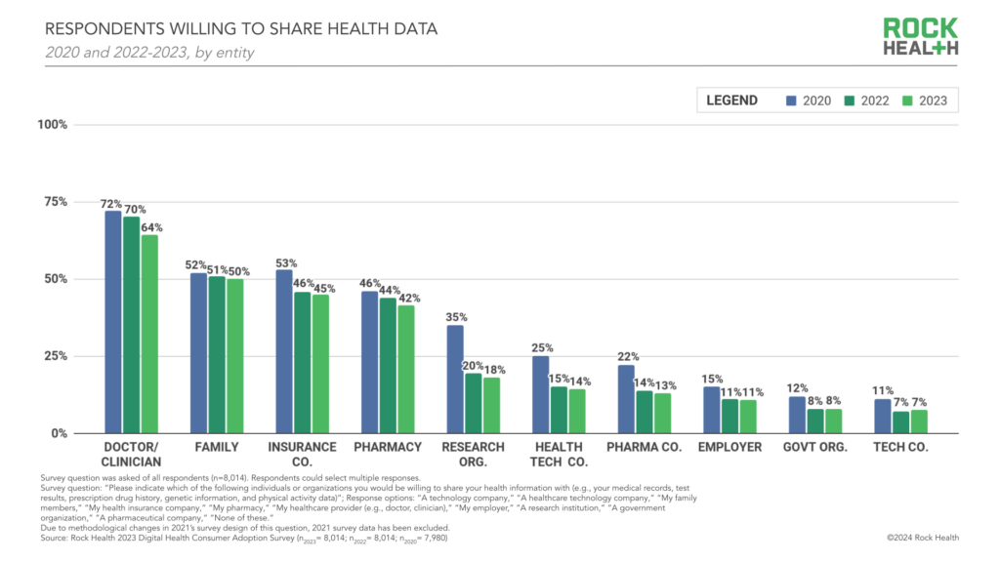
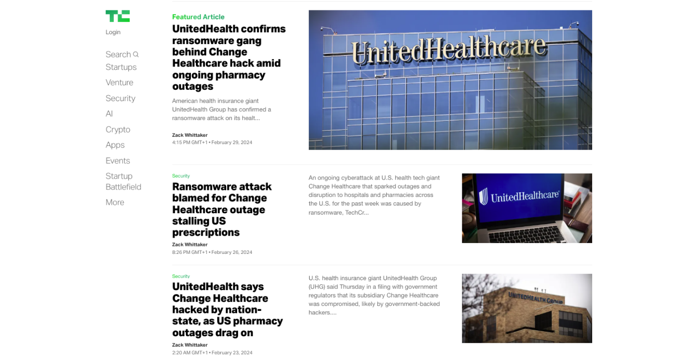

**With this tutorial, you'll receive step-by-step instructions on how to conduct an internal security audit of your healthcare software, along with a list of dozens of tools to assist you in the process. Most of these tools offer free trials, allowing you to quickly test them and then decide if they're the right asset for your team.**

Only [14% of patients](https://rockhealth.com/insights/the-new-era-of-consumer-engagement-insights-from-rock-healths-ninth-annual-consumer-adoption-survey/?mc_cid=1d086c1225&mc_eid=fbb3bdc963) want to share their health data with HealthTech companies, and their willingness fades year by year (in 2020 22% of patients opted for sharing their healthcare data). 

 Source: [Rock Health](https://rockhealth.com/insights/the-new-era-of-consumer-engagement-insights-from-rock-healths-ninth-annual-consumer-adoption-survey/?mc_cid=1d086c1225&mc_eid=fbb3bdc963) 

Can you blame patients? Just visit the TechCrunch healthcare section to see countless stories about data leaks, hacks, and more. Why should patients trust healthcare tech companies with their data? Unfortunately, even if you aim to implement top security practices, you are facing the same mistrust issues as part of the industry. So, how can you build trust among your users? Secure product is the right answer. Let’s discuss security measures you should incorporate in your HealthTech company. 

 Source: [techcrunch.com](https://techcrunch.com/tag/healthcare/) 

## Audit your software and start Secure Software Development Life Cycle

You should implement dozens of security tactics that will audit your software internally and kick off your Secure Software Development Life Cycle (SSDLC).

### Adhering to OWASP best practices

The security bible for many is the set of security checklists OWASP provides. Begin by making sure your software team adheres to OWASP security resources. Methodically progress through every top OWASP checklist and verify with your software team that you have implemented these recommendations.

👉 [The list of OWASP resources](/blog/top-owasp-resources-to-follow/)

## Static Application Security Testing (SAST)

Static Application Security Testing (SAST), using dedicated SAST tools, will scan your app's code and alert you to any vulnerabilities, such as SQL injections, outdated algorithms, or strings that could be potential passwords.

👉 [The list of SAST tools to consider](/blog/examples-of-sast-tools-for-app-security/).

## Dynamic Application Security Testing (DAST)

DAST tools often provide the ability to proxy requests, record them, tamper with them, replay them, inject parameters, build a site map by crawling, and more.

👉 [The list of DAST tools to consider](/blog/examples-of-dast-tools-for-app-security/).

## Track dependencies

Dependency tracking tools assist in identifying outdated or vulnerable dependencies in our code e.g. libraries, frameworks, plugins, or other software modules that a project relies on to function. Track dependencies tools support effective code modernization by automatically highlighting places that should be updated.

👉 [The list of dependency-tracking tools to consider](/blog/examples-of-dependency-tracking-tools-for-app-security/).

## Detect secret leaks

Detecting secret leaks involves identifying instances where sensitive information, such as passwords, API keys, secret tokens, or private keys, have been unintentionally exposed in places they shouldn't be like public repositories, open documentation, or log files. There are tools and practices designed to prevent and detect these leaks.

👉 [The list of secret leaks detecting tools to consider](/blog/secret-leak-detection-tools-to-consider-for-your-app-security/).

## Infrastructure reconnaissance

Infrastructure reconnaissance tools allow businesses to scan their infrastructure for vulnerabilities, including outdated software versions, open ports, and misconfigured security headers.

👉 [The list of infrastructure reconnaissance tools to consider](/blog/infrastructure-reconnaissance-tools-for-your-app-security).

## Adhere to local data protection laws

Use GDPR & HIPPA-compliant software for medical data processing. By signing up for a cloud provider you might get access to HIPPA-compliant architecture to process medical data. It’s the fastest way to achieve HIPPA or GDPR compliance.

<blockquote><h2>As one can read on AWS website</h2>
AWS enables covered entities and their business associates subject to the U.S. Health Insurance Portability and Accountability Act of 1996 (HIPAA) to use the secure AWS environment to process, maintain, and store protected health information.
<footer>Source: https://aws.amazon.com/compliance/hipaa-compliance/</footer></blockquote>

What’s more, the cloud enables data backup and disaster recovery, ensuring that HealthTech organizations can quickly recover from data loss events and maintain continuity of care without the need for extensive on-site data storage facilities.

## Utilize managed identity services

Cloud providers offer various tools to help you manage users' sensitive data securely. One such tool is AWS Cognito, designed to securely add user sign-up, sign-in, and access control to web and mobile applications. AWS Cognito encrypts user data, supports multi-factor authentication to add a level of security, and helps detect unusual sign-in activities. [Read more on AWS](https://docs.aws.amazon.com/cognito/latest/developerguide/managing-users.html).

Naturally, you can create own customized solutions to manage user data; however, there is a higher risk of incorrect implementation, and you need to remember to update the software on your own. Don’t reinvent the wheel seems like a smarter approach in this case.

Bright Inventions' team primarily works with AWS tools; therefore, we are showcasing examples from Amazon's suite of services. Although providers like Google Cloud or Microsoft Azure also offer tools designed to comply with major security standards and certifications.

## Maintain separation of concerts

Don’t store sensitive data in one place. You make the work for attackers simpler. Each encrypted database should be stored in a different physical location provided by cloud providers. One database can store patients' private data (name, age, social security number, etc.), while another should store medical information. Therefore, the risk of leaking data from both databases is much lower. What’s more, keep your staging and production sites in separate networks with different authorization levels limiting the number of users gaining the access.

<blockquote><h2>How we introduced this tactic while building a mobile app for people with Parkinson’s</h2>
Given its healthcare nature, the app stored sensitive medical data on patients’ health, including information on pain and tremors, as well as data on very specific side effects, such as sexual drive levels and gambling propensity. One of the security tactics we implemented was breaking down the encrypted database into two – each stored in a different AWS services’ physical location. The first database stored basic user data, such as name or email address. The second database kept sensitive medical information, including medication intake or physical symptoms and side effects. Through this decision, we minimized the chance that, in the event of a data breach, the attacking party would be able to access all the information. Therefore, even in the case of a data breach, the risk of matching symptoms to specific patients' names is low.
<footer>Mateusz Klimczak, Partner & Head of Delivery at bright inventions</footer></blockquote>

## Utilize LLM's securely

LLMs are at the forefront of the AI revolution in healthcare. Discover what steps you need to take to ensure your LLM solution is secure and compliant with HIPAA or GDPR, in case you use OpenAI solutions.

Good news! The OpenAI API is eligible for GDPR and HIPAA compliance under a few stipulations. 

Delve into [LLMs fot healthcare](/blog/llms-healthcare-security/) in another blog post.

<EbookDynamic sectionTitle='ready to face other HealthTech challenges?' ebookName='Scale-Your-Healthtech-Solution-Successfully.pdf' ebookDescription={'We\'ve got much more resources for you! Download our free guide for HealthTech leaders.'} ebookImage='/images/healthtech_guide_cover.png' ebookAlt='cover' />