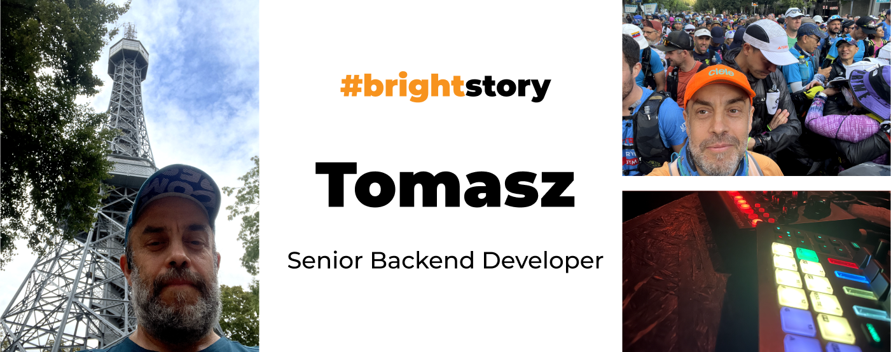
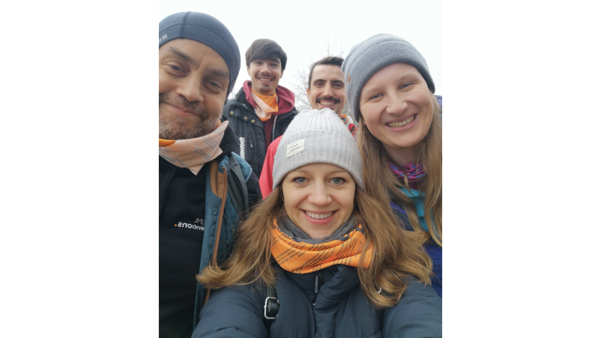
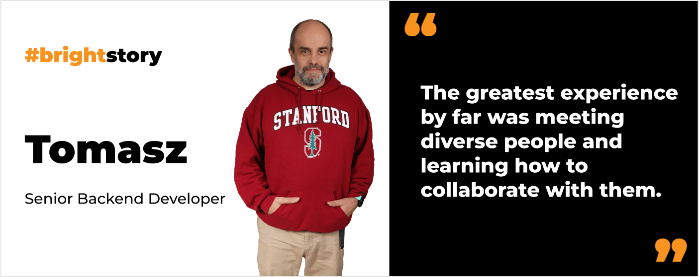

**Dive into the career story of Tomasz, whose journey to programming began in the 80s. Find out what was the first programming language that Tomasz learned. Discover his Tech Lead approach and explore how his programming expertise crossed paths with… welding.**

## Could you describe your journey into programming?

It began a long time ago, **back in the 1980s**. At that time, **I only had access to 8-bit computers**. I highly enjoyed playing computer games then, but what intrigued me even more was understanding the mechanics behind them. This curiosity led me to **start programming, initially in BASIC**. However, I didn’t think at the time that it would become my future profession. I had many other interests, including radio. I was part of a radio club where we got to work with computers, which was a significant deal during the twilight of communism in Poland. The experience of working with hardware and electronics was truly captivating.

In the 1990s, I worked as a graphic designer, creating posters and other printed materials. As the company I worked at began to expand its portfolio to include web development, I **seized the opportunity to learn Perl and PHP (version 2.0 at the time) as well as Linux**. That marked the start of my career in software development.

## What happened after that?

After that I worked for a small software development company in Poznań, then, I entered a corporate phase, working for global enterprises. I **had an opportunity to spend a month in Silicon Valley, in a building that is now the headquarters of Facebook**. It was on the same campus where **I met legends like James Gosling**, the creator of Java. Back then, it was easy to bump into him in the cafeteria.

Later I even got a chance to live in the U.S for 18 months as an Oracle employee. I worked at its American headquarters. Back then **I spent lots of time at Hacker Dojo – one of the most famous coworking spaces where numerous Silicon Valley unicorns were born**.

Eventually, I left the corporate world but I still cooperated closely with enterprises as a business partner by **starting my company and employing a few people to digitize clients' processes**. One noteworthy project we undertook was the digitalization of welding processes. **We developed an IoT system that modernized welding operations for a chemical engineering company**.

## Welding and programming? How come?

It might seem like an unlikely combination at first. Indeed, when we embarked on this project, my knowledge of welding was as basic as most people's. Welding, particularly for critical structures like ships, and fuel tanks demands extensive documentation due to the legal responsibilities shouldered by the individuals involved. **A mistake in the welding process can potentially compromise the integrity of a ship or a tank, posing a direct threat to lives**. 

**We developed software integrated with various devices and sensors to measure critical factors** such as temperature, ambient conditions, and weld intensity to **ensure the highest quality of welding**. This approach was significantly more efficient than the previously used ultrasonography for weld inspection. Thanks to the comprehensive data our system collected, **the welding team could definitively demonstrate compliance with all requirements**.

Our role encompassed **integrating hardware** delivered by another company into our system, **developing the firmware, selecting appropriate sensors, and delivering software** that unified these components into a cohesive IoT solution.

## How did you learn the welding domain?

It might surprise you that there are numerous types of welding, and **our solution was specifically tailored for Metal Inert Gas (MIG) welding**. I remember **diving into a thick book on the subject** to grasp the complexities involved. Apart from that, **I visited the client’s R&D center and had access to their experts at any moment**. 

Additionally, **I attended various conferences for the welding community**, where I met many individuals who were deeply passionate about welding. These enthusiasts could discuss the images of welds for hours. While every industry has its 'fanatics', encountering such dedicated people was genuinely intriguing.

## From the corporation world to a smaller company like Bright Inventions. How do you find yourself here?

I appreciate the absence of a corporate vibe here. With around 80 people on board, the company is the perfect size for me – not too small, not too big. **Everyone possesses high-quality skills and expertise**. I love how **every team member feels responsible for their project and even for the whole company**. The atmosphere is something I truly enjoy. Although **I work mostly remotely from Poznań, whenever I attend team retreats in Gdańsk, I feel well taken care of by teammates** who always make me feel welcome.

## Having spent decades in the IT industry, what experiences do you consider the most valuable?

Every time I ventured into a new technology, it felt like encountering something magnificent; I definitely have relished the experience of discovering new tech. However, **the greatest experience by far was meeting diverse people and learning how to collaborate with them**. 

Although I consider myself an introvert who masks it well, there was a point in my career when I became a team manager. Consequently, one of my responsibilities involved dealing with aspects of psychology in the workplace.

Initially, **I made the mistake of trying to solve people's problems with my own prescriptions**. I attempted to offer advice based on my experiences, which was rather naive. At that time, I didn't understand much about human relations. **I thought that since I didn't have a particular problem, I could provide a magical recipe to solve others' issues**, believing my insights would make the world a better place. This approach was fundamentally flawed. I couldn't possibly understand other people's struggles thoroughly, and I definitely didn't have a monopoly solution to complex human issues.

## As a tech lead at Bright Inventions, what is the most important aspect of this role?

I think that the ability to view the product from a distance and see the whole picture is invaluable. **I strive to consider both the domain and business perspectives, with a key focus on ensuring that the architecture evolves alongside the product**. This approach makes the software easier to maintain. Thus, the primary rule is to **avoid creating technological debt, paving the way for a smoother future product growth**.

## How to find the balance between tech ambitions and business requirements? 

I believe **I have an intuition that guides me in determining when to persuade a client to follow our recommended path, and when to step back**, recognizing that the client may lack the resources or willingness to proceed. 

It's crucial to choose our ‘battles’ wisely. **Given that our clients trust us, when we emphasize the necessity of certain implementations, they are likely to listen**. However, it's equally important to ensure that the development schedule is followed. This means that we must deliver value even if it occasionally requires postponing some code modernizations. **Clients are primarily focused on the product's growth rather than perfect code**. Therefore, addressing technical debt cannot always be our top priority.

