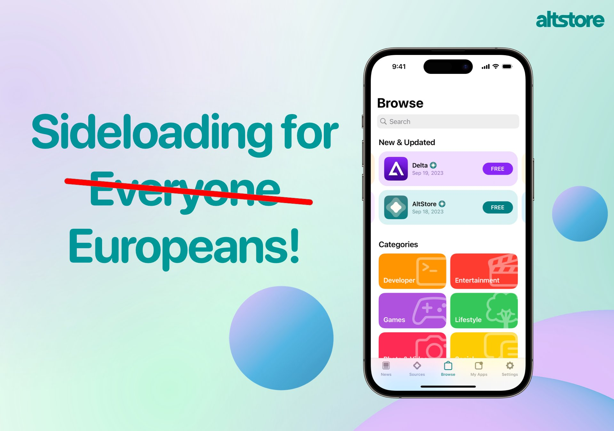

**Apple is forced by the EU to introduce the ability to install apps by alternative marketplaces other than AppStore. What does it mean for iOS developers and app owners? In this article, I will cover the main tech and business requirements to set up your marketplace.** 

The directive, called the **Digital Markets Act (DMA)**, which **will be effective in March 2024**, implies on Apple some major changes, the most important ones are:

* make it possible to install apps by the alternative marketplace;
* allow external payment providers;
* allow users to use alternative browser engines.

**This article covers the first of the implications, which is alternative marketplaces.**

# What is an alternative marketplace? 

Currently, iOS allows users to install apps from AppStore, Testflight or by Enterprise and MDM programs. **Alternative marketplace will be a completely new method of installing apps in iOS, but Apple doesn’t just open iOS for installing any app from any source known i.e. as sideloading.**

**To install an app from an alternative marketplace, users will have to first install an alternative marketplace app developed by an entitled marketplace developer.** After installing the marketplace app, they will be able to browse and install apps from it like they currently do through the AppStore app.

To become a marketplace developer, **multiple requirements need to be met**. A developer needs to accept new business terms, request the “Alternative App Marketplace Entitlement (EU)” and meet multiple criteria required by Apple. One of these requirements is providing “a stand-by letter of credit from an A-rated (or equivalent by S&P, Fitch, or Moody’s) financial Institution of €1,000,000 to establish adequate financial means in order to guarantee support for your developers and users”.

See guides from Apple:

* https://developer.apple.com/support/alternative-app-marketplace-in-the-eu/
* https://developer.apple.com/support/dma-and-apps-in-the-eu/#ios-app-eu 

Considering that you will meet all the requirements and Apple will agree to grant you such entitlement, the rest of the work is building a marketplace app and providing apps for it.