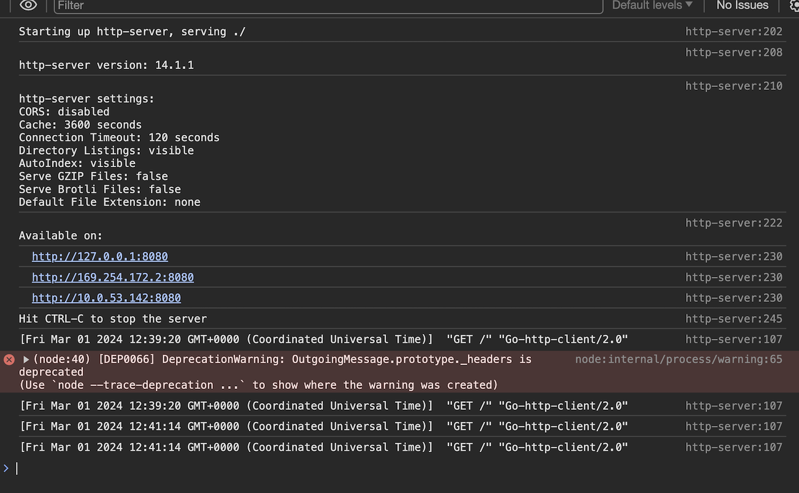

<div className="image"></div>

**Recently my colleague wrote a blog post on how to create a [cheap Node.js Fargate service](blog/aws-cdk-cheap-ecs-fargate/). Imagine that after some time of happy running, we investigate that something is not clearing memory or the task suddenly exits with an error. We analyze the log and metrics, but the issue seems deeper, and we have to get our hands dirty. For such cases, a great option to [debug](https://nodejs.org/en/learn/getting-started/debugging) the Node.js service is `--inspect` flag. In this tutorial I will show you how to utilize it with CDK deployed Node.js app on AWS Fargate using Exec and SSM port forwarding.**

## Node.js debugging

Node.js `--inspect` [debugging](https://nodejs.org/en/learn/getting-started/debugging) might show you potential problems with the event loop or where is the memory leak you are looking for. It personally helped me many times. If you are interested about the details and how to look for problems, you can see a great video of it in action with one of the [core contributors](https://www.youtube.com/watch?v=vkys6Wk-jYk&ab_channel=AdventuresinNodeland-MatteoCollina) of Node.js.

## Remote Node.js debugging

Ok, so you are armored with cool knowledge about Node.js debugging now. You say, “Great! Let’s run inspector and check it out.” Not so fast—your service is running in a remote environment. It means that you somehow have to expose a remote debugger to your local inspector environment. Sometimes, it is not necessary as you might be able to spot the problem when running the process locally. But what if the problem only appears when some particular thing happens on a remote? Traditionally, you could just expose the inspected port via [SSH local forwarding](https://nodejs.org/en/learn/getting-started/debugging#enabling-remote-debugging-scenarios). But what if you are running Fargate and you are not able to SSH? Let’s find out!

## Checking if your task is eligible for ECS exec
Ok, so your task is running. What shall you do next? We will use a combination of AWS exec and SSM port forwarding to forward the debugger port to the local machine. AWS has an official [GitHub repo](https://github.com/aws-containers/amazon-ecs-exec-checker) with a script by which you can check if your task allows for AWS exec. When I deployed the infrastructure we prepared [before](blog/aws-cdk-cheap-ecs-fargate/), I executed 
```bash
./check-ecs-exec.sh BrightCheapEcsFargateStack-ClusterEB0386A7-PQVGdDDGFxS4 70d6a6e5606b4cf5ad413821326bd765
```
As per the output, my task was missing some of the required things for exec execution: 
```bash
  Exec Enabled for Task  | NO
```
```bash
Task Role Permissions    
     ssmmessages:CreateControlChannel: implicitDeny
     ssmmessages:CreateDataChannel: implicitDeny
     ssmmessages:OpenControlChannel: implicitDeny
     ssmmessages:OpenDataChannel: implicitDeny
``` 

[Readme](https://github.com/bright/bright-cheap-ecs-fargate-https) provides directions on how to fix the potential issues you might have. It might be connected either to your IAM user, ECS task role permissions, or configuration. For the repo we are using, the only two things that I needed to add were:
```typescript
enableExecuteCommand: true
``` 
to `FargateService` in CDK definition and
changing our container command to expose debugger 
```typescript
command: ['npx', '--node-options=--inspect', 'http-server']
```
Upon CDK deployment you will see that required `ssmmessages` permissions are automatically added.
When I rerunned the [script](https://github.com/aws-containers/amazon-ecs-exec-checker) I could see that all controls were green or yellow. That means I can connect to my task using AWS exec! 


##  Connecting to Fargate ECS task 
To do it, you need to know `cluster-name`, `task-id` and `runtime-id` of the task first. 
I got those by running 
``` bash
aws ecs describe-tasks \
    --cluster BrightCheapEcsFargateStack-ClusterEB0386A7-PQVGdDDGFxS4 \                                                                                  
    --task 70d6a6e5606b4cf5ad413821326bd765   
```
Runtime ID in my case was `70d6a6e5606b4cf5ad413821326bd765-2750272591` so I did run of the following:
```bash
aws ssm start-session \
    --target ecs:BrightCheapEcsFargateStack-ClusterEB0386A7-PQVGdDDGFxS4_70d6a6e5606b4cf5ad413821326bd765_70d6a6e5606b4cf5ad413821326bd765-2750272591 \
    --document-name AWS-StartPortForwardingSession \
    --parameters '{"portNumber":["9229"], "localPortNumber":["9229"]}'
``` 
Where target is a string that consists of `ecs:<cluster-name>_<task-id>_<container-runtime_id>`. Port `9229` is the default port for Node.js inspector.
As a response I got
```bash
Starting session with SessionId: rafal.hofman@brightinventions.pl-06148b47c2f094b19
Port 9229 opened for sessionId rafal.hofman@brightinventions.pl-06148b47c2f094b19.
Waiting for connections...

Connection accepted for the session [rafal.hofman@brightinventions.pl-06148b47c2f094b19]
``` 

##  Running local inspector with remote ECS target
I went to the inspector in my [Chrome browser](chrome://inspect/) and there I could see the remote target I just enabled, forwarded to my local port of 9229
<div className="image"></div>

Upon connection, I could see logs from the Node.js process and could go ahead with debugging.

<div className="image"></div>
<div className="image"></div>

As you can see, the process is pretty straightforward. We do not have to expose our `--inspect` port publicly, but we safely use AWS SSM port forwarding. 
What is important, the task can have a private IP, and you can still access it! 
If needed, you can also use AWS exec to bin/bash to the container. Remember to remove enableExecuteCommand when you are done. Happy coding & debugging!


