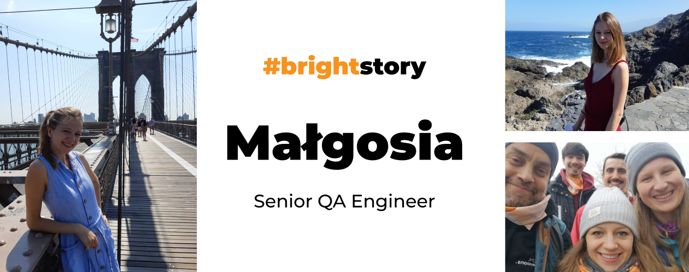
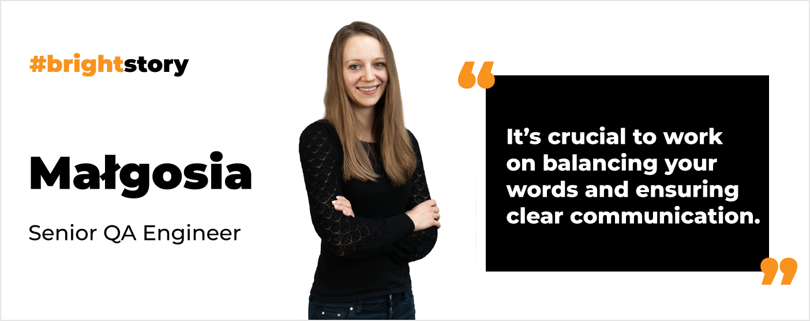
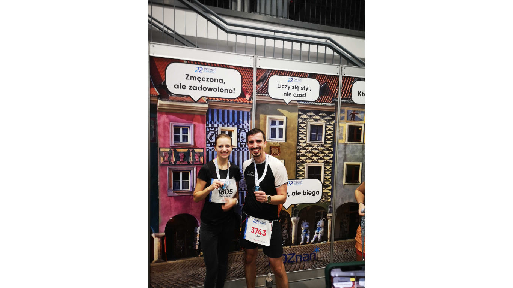

**Nearly 9 years ago, Małgosia decided to transition into QA engineering, long before it became a trend. Once she discovered her passion for automated testing, there was no turning back. Now, she thrives on tackling daily challenges, from balancing the right test coverage to building robust relationships with developers. Dive into Małgosia's career story to explore her journey!**

I think I was among the first people who tried switching to software development before it became popular. At that time (about 9 years ago), I didn't know any success stories of such a transition; in fact, I had only heard about failures. But I still wanted to give it a try. So, I committed fully to this new path — **I quit my job and dedicated my time to learning every day**. 

Initially, my goal was to become a software developer. After two months of intensive learning, I began job hunting. I even received a software developer job offer. However, during this period, **I started writing my first automated tests, and it completely captivated me**. **I found immense enjoyment in it**. As a result, I turned down the software developer job and instead sought out a QA position. **Fortunately, I found a place where I could engage in writing automated tests right from the start**.

## I assume that back then there weren’t many software testers in the teams?

Oh yes, **I was the only tester in the team**. There was another tester in the company where I worked but I didn't know many other QA Engineers back then. Obviously, **the situation is quite different now**.

## What aspects of the QA job give you the most satisfaction?

What drives me in my QA role is the unique set of challenges each project presents, **pushing me to constantly rethink testing and automation strategies**. Every project offers the **opportunity to find the perfect balance between manual and automated testing** and to select the right types of tests that are easy to maintain, credible, and reliable. 

Throughout my career, I've encountered the mindset that 'we don’t have time to write automated tests,' but in reality, automation actually saves time. When we're not required to test everything manually, the quality of the product usually improves. Reaching this point in a project is incredibly satisfying. 🙂

<h2>Join Małgosia</h2>
We are looking for a business-oriented QA Engineer (regular exp.) to join one of our project teams responsible for building a Card Tracking System for one of the global humanitarian organisations.
<a href="/jobs/qa-engineer/"><button>apply now</button></a>

## What is your recipe for successful cooperation with programmers?

**It’s a continuous learning process because throughout your career, you work with various people, each with different personalities**. Everyone has their own priorities in projects, and sometimes it can be challenging to persuade someone to see things from your perspective and to focus on your priorities. 

What I’ve learned recently is that people can interpret your words differently. For instance, if I say something in a meeting, 2 out of 3 people might understand it in a way that's completely different from what I intended. Therefore, **it’s crucial to work on balancing your words and ensuring clear communication**.

*Read Małgosia’s and Michał’s blog posts on [successful dev-QA relations](/blog/communication-challenges-faced-by-developers-and-testers/).*

## How do you react when a developer says 'It’s not a bug, it’s a feature'?

I haven't heard that phrase much lately. It seemed more common among developers who were just starting in the industry. However, if I encounter that statement, **the first thing I do is to verify if it actually is a feature**. This is quite straightforward - you can always compare the current product with earlier versions. **If I still believe it's a bug, I'll present my arguments and then listen to the developer's perspective. We then discuss and work towards a solution together**. 

In situations like this, **[empathy](/blog/three-dimensions-of-empathy/) is crucial — understanding the developer's viewpoint, listening to their arguments, and trying to grasp why they might see things differently**. If I'm convinced that something could compromise the quality of the product, I'll stand firm in my position. Yet if it turns out that my assessment was incorrect, I'll certainly let it go.

## What types of automated tests do you value the most?

**I value API tests the most due to their stability, accuracy, speed, cost-effectiveness, and broad applicability**. They **provide a sense of security**, which I believe is crucial for every QA Engineer. Of course, UI tests are essential too, but they serve a different purpose and can be somewhat 'flaky'. They often fail in the pipeline, not necessarily due to bugs. This inconsistency makes them less reliable in terms of providing a sense of security, so it's harder to trust them as compared to API tests.

## There is an ongoing recruitment process for QA Engineer at Bright Inventions. What advice could you give to candidates?

In my opinion, **the ideal candidate should be adaptable to changes and various project dynamics**, because at Bright Inventions, we are flexible and strive to adjust to the specific needs of our clients and projects. **This person also needs to have a strong desire to develop as a tester, be eager to learn, and be prepared to work with different people and personalities**. So, I guess they should also be **open to speaking their mind and sharing their ideas and knowledge**.

*
During a team retreat in the center of Gdańsk.
*

## And how do you recall your recruitment process at Bright Inventions?

I wasn't actually planning to change my job. **When [Agata](/about-us/agata-m/) approached me on LinkedIn, I responded as I usually did — politely declining with a thank you**. However, her response to my decline piqued my interest. **I won't give away her secret methods, but she somehow managed to convince me to attend an interview**, and eventually, I ended up joining the team here.

")

*
Another team retreat. :)
*

## How do you spend your spare time?

I spend it actively, for sure. **I'm really into running. I've always enjoyed it but never had someone to share this passion with until I joined the running workouts at Bright Inventions**. Thanks to our trainer, [Bartosz Banach](https://bartoszbanach.pl/), and his coaching, I was able to finish a marathon. 

*
Małgosia and Filip from Bright Inventions at a running event.
*

**I'm also quite a health lifestyle enthusiast**. I love reading about nutrition, diets, self-care, and more. I aim to spend my free time actively and meaningfully, so I don't use Netflix, and I generally avoid watching TV series or movies.

## Not at all?

Well, maybe sometimes. 😄 I just need to control myself because once I start a series, I tend to binge-watch it right away. So, I prefer not to start watching anything at all...