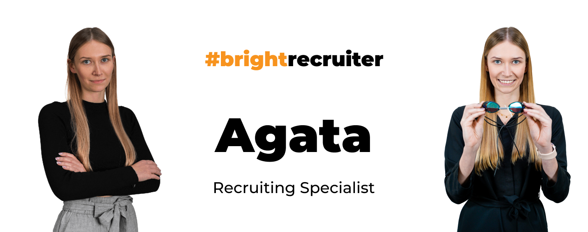
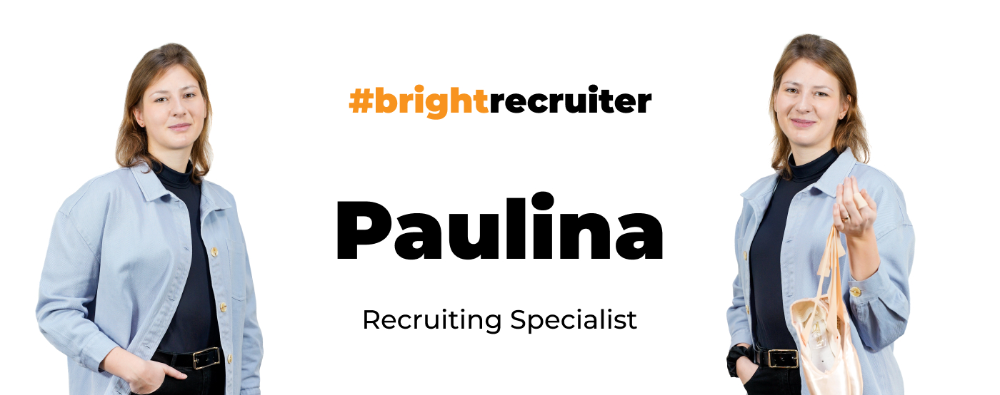
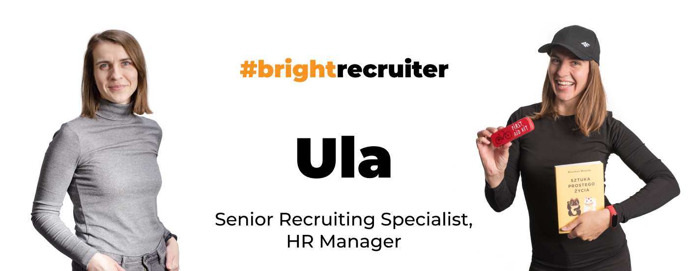
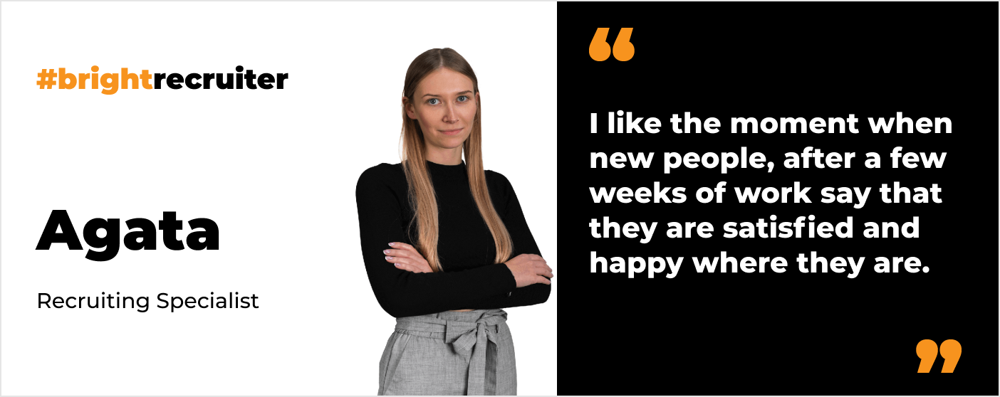
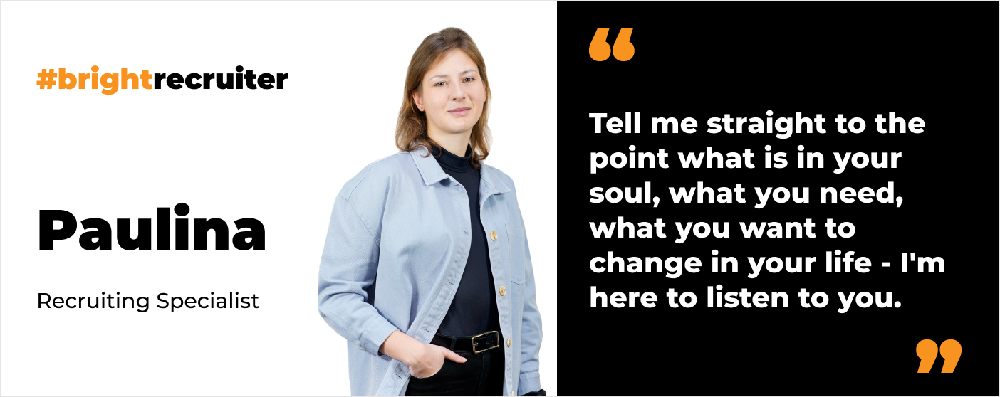
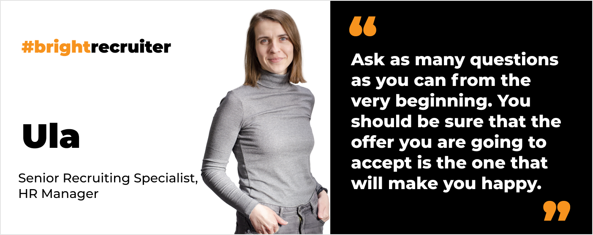
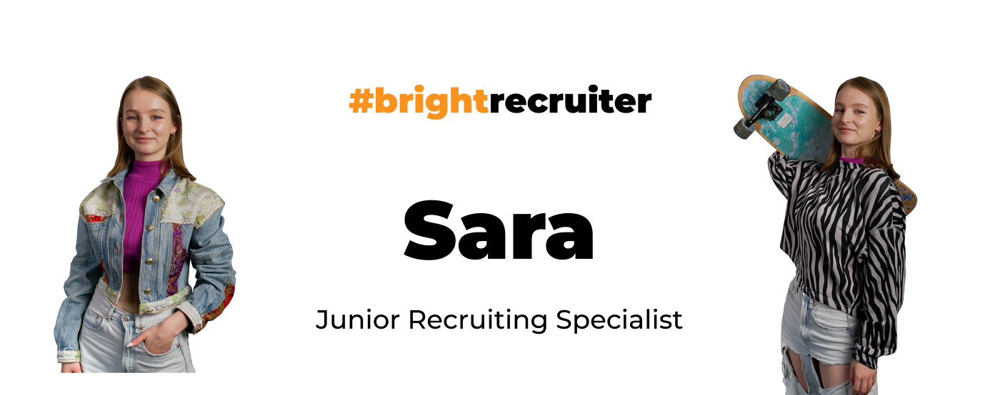

Recruiting success is not necessarily a measure of the volume of candidates obtained. Successful recruiting teams are able to quickly identify the candidates that are most likely to make a positive impact on an organization. It requires much more than looking beyond a candidate’s credentials. 

Today we would like to present to you our bright recruiters - [Agata](/about-us/agata-m/), [Paulina](/about-us/paulina-t/), [Sara](https://brightinventions.pl/about-us/sara-l/) and [Ula](/about-us/ula/) who on daily basis take care of our recruiting process and talk with dozens of candidates to check if our company is a unique and desirable place for them. We asked them a few questions so that you can get to know them a bit better. 

## How do you recall your own recruitment process at Bright Inventions?

**Agata:** I remember my recruitment process really good - not only because of that I was hired. :) From the very beginning Ula presented the steps of the entire recruitment process in detail, thanks to which I knew what happened next. That was really helpful. When it comes to the interview, it was very pleasant because it was a real conversation and not Q&A. (It surprised me.)

**Paulina:** I recall it as engaging, but with very positive impressions after all. From the very beginning, I felt that I was actively listened to, and my honest, transparent and sometimes unconventional answers were met with respect and full understanding. It was this kind of process I would want to offer to candidates as a recruiter myself. It gave me additional confidence that the role I was applying for was aligned with my own life values.

**Ula:** It was very smooth, concise and positive. I had an interview with Michał and Daniel, the founders of Bright Inventions. I think we got on well from a few first minutes. They were super friendly, engaged and enthusiastic. I had done some research of the brand before we met, so I had a list of things I would like to implement if I would be hired. \
\
**Sara:** That process was very surprising for me - I remember the girls (my recruitment process was conducted by Ula and Agata) really wanted to get to know me. Questions were constructed in a way that allowed me to share my attitude and way of thinking. I had no experience in recruitment or IT, and I did not know the answers to so many questions (that's how I remember it :p). I recall that during the interview, I had the thought that there was no way for me to get this job, but at the same time, I had a really good time with Ula and Agata. I felt respected. :)

## Why did you decide to join Bright Team?

**Agata:** I applied for the position of junior recruitment specialist. I felt good energy and professional approach during the interview so my first thought was that Bright is the right place for me to take the first steps in my career. Moreover, people on Bright social media also looked positive and this visible sport spirit  - I realised immediately that it is a great place for me.\
\
**Paulina:** From the very beginning of my career, I felt that the role of a recruiter is not just a stereotypical testing of a candidate's skills with an inherent element of stress. I know from my own experience how uncomfortable and, most importantly, how unprofessional and disrespectful it is. When I got to know the values of Bright Team, I felt that in such environment I could be simply myself and fulfill my beliefs. The recruitment meeting with Ula - my former recruiter and current leader - was just a real confirmation of my assumptions. 

**Ula:** The brand was not recognisable that time. I needed space where I could use my skills and people who would trust my intuition. I had a lot of ideas, I met interesting people during the interview and realised I had a chance to create something valuable almost from scratch. I am always saying that Bright Inventions was almost like a blank page and I really wanted to colour that page.\
\
**Sara:** To be honest - it was by accident. My plan for 2023 was to prepare for a recruiter role and maybe (if I was lucky) land a recruiter job by the end of the year. My target was an IT company. However, I didn't have time to start preparing. :D I stumbled upon a job offer for a Junior Recruitment Specialist and thought, 'Why not? I'll give it a try.' So I did, and in early January 2023, I got the job. When I got this job, I realized how much I fit in here. 

## Why did you choose a recruiter's path career?

**Agata:** I like the fact that thanks to my work I can meet many interesting and ambitious people. I always wanted to be in a place where I would have a real impact on the development of myself, the company, and be able to contribute to the professional development of others. I think that thank to being a recruiter I will get it.  :)\
\
**Paulina:** The role of a recruiter is related to my psychology background. The academic experience directed my skills and mindset as analytical and human-centered, which was only a formal confirmation of my prior self cognition. I have always found myself in the role of an active listener and it has given me pure joy and satisfaction. As additional confirmation of this hypothesis, I noticed in my callers a sense of listening, often a relief. I recognized this fact as my strength and decided to use it in my professional career. :) 

**Ula:** I think this role somehow chose me. I was perusing the career of marketing specialist, translator and tutor when after a few years recruitment appeared in my life. After entering this field I realised I had some skills that I hadn't perceived as anything unique before. At first I decided to focus on employer branding and recruitment marketing and then discovered my real interest into recruitment area. Now I am 3 in 1 . :)  \
\
**Sara:** Short story - I had a feeling that this was my career path. I wanted a job where I could use my personal skills, psychological knowledge, and be close to people. That's it. :)

## What do you like most about your job?

**Agata:** I like the moment when new people, after a few weeks of work, say that they are satisfied and happy where they are. It motivates me a lot to work harder, and new employee’s contentment is such like a reward for me. :)

**Paulina:** While many single aspects come to my mind, the biggest gratitude I feel when I know or observe from a candidate's behavior that he/she simply feels comfortable in my presence, that feels listened to and treated with due respect. I feel best when I know that my candidate made a bond with me, got an added value from the hiring process, and felt that he or she and his/her story was unique and one of a kind for me. 

**Ula:** The fact that I can meet dozens of interesting people and help them find a good place for their development. And the fact that I am learning all the time. Every person is a new experience. The structure of the recruitment process is well-defined, but people are not defined at all. You can ask the same questions, but every time you get different answers. Every person that I meet teaches me something new. \
\
**Sara:** I think there isn't just one thing I like the most. Basically, I enjoy the diversity of my responsibilities. IFor sure screenings and interviews are one of my favourite parts. I enjoy talking with people, and fortunately, in my role, I have many opportunities to do so. On the other hand, I also like the sourcing process - listening to loud, rhythmic music and searching for passive candidates can be very relaxing for me. Additionally, I enjoy writing - in my role, I write feedback, LinkedIn posts, and blog posts. The balance between all of these aspects makes my job really pleasant and satisfying.

## Is there any (memorable, non-standard) recruitment experience you remember till today?

**Agata:** I can give an example of the conversation before the whole recruitment process. One of my candidates could not call me because he was on holiday, so I told him that we could go back to the conversation after his trip and wished him a good rest. I also added that he would send some photos from the holidays (that was a joke). The funny thing was that I got a few pictures a week of this trip ex. sunset or sea. That was so nice, and I was really surprised.\
\
**Paulina:** There would be a bit of that, but the first story that comes to my mind is a pandemic interview with a developer who was wearing sunglasses, a short-sleeved shirt with holiday flowers and an exotic-oceanic backdrop at Google Meet the entire time. :) 

**Ula:** A lot of them. I usually remember quite well all the processes I have run. For sure there have been things that surprised me such as candidates disappearing suddenly during an online meeting. :D But I think the most memorable for me are situations when people share their feelings with me and I can get to know them as real human beings not only as professionals. \
\
**Sara:** There are moments like that - these are my favorite screenings when I feel people’s vibe and I sense that the person could be my mate. But I also have one funny moment - I remember that once I wished 'Niech Wam ziemia lekką będzie' to a super cool candidate who had just gotten married. It means ‘Rest theirs souls’, but it sounded so nice to me, and I had no idea of its true meaning.

## What is your advice for potential applicants?

**Agata:** Firstly - be yourself. Secondly - take the recruitment process seriously. Book enough time and sit in a quiet place where you can talk freely. Thirdly - be honest. We are very transparent with you - be like that with us. 

**Paulina:** Get to know the real you:) Tell me straight to the point what is in your soul, what you need, what you want to change in your life - I'm here to listen to you. All these elements are extremely important to me, because thanks to them you allow me to verify whether the role we are talking about is able to meet your expectations. Recruitment is a two-way transaction, so don't be afraid to ask me anything - I'm here to make sure that you can learn as much as possible about all aspects of working in our team, so that I as a recruiter can be sure that you are confident and ready to take on a new challenge. Also, if you feel like joking with me and having a little fun, I'll be more than happy to! After all, we are talking about something super cool, which is working together every day, so let's get to know each other as regular people too!;)

**Ula:** Ask as many questions as you can from the very beginning. You should be sure that the offer you are going to accept is the one that will make you happy. Do not look at the job offers only through the prism of salary ranges. Money is important, but there are some other key aspects worth keeping in mind - your future team, project, level of independence and responsibility, even tech stack. Ask about them. \
\
Choose wisely and be honest with us and with yourself. \
\
**Sara:** Trust us, we're on the same team. ;) We want you to feel as comfortable as possible when sharing your knowledge and experience with us. We understand that the recruitment process can be stressful and may affect the outcome of sharing your knowledge and experience. However, please remember that our goal is to understand your knowledge and experience as thoroughly as possible. Even if this particular position doesn't work out, we remain open to future cooperation.

## How do you learn? How do you stay up-to-date with IT industry?

**Agata:** Mostly, I am looking for information about IT Recruitment. I participate in webinars, read blogs, and listen to podcasts. I also watch tutorial videos for developers to get closer to these topics and learn more about technologies and programming languages.

**Paulina:** In addition to the strictly HR knowledge contained in webinars, blogs, authority profiles on LinkedIn, industry books, or conferences, I try to expand my knowledge in the area of daily developers' work. So I read Uncle Bob, talk to developers, participate in initiatives for developers both inside and outside of my team, ask my teammates (and my husband;)) silly technical questions - summing up, try to be close and immerse myself in the specifics of this profession, learn about the daily challenges in the programming world as much as I can.\
\
**Ula:** By reading business and psychological books, listening to HR podcasts and talking with people. :) If it comes to functional programming knowledge I have a great team here who is always supportive and able to explain even the most complex programming issues. It is enough to ask and you are provided with all the information you need. 

**Sara:** For me, the best way to learn is by talking, asking questions, and repeating things. I also enjoy listening to (and being part of) technical conversations - fortunately, I have technical people around me, which is very helpful for understanding what programming is about. I've even tried writing some code to see things from a developer's perspective.

## Do you have any motto that you really like?

**Agata:** *Letting go also becomes a habit.* It always motivates me to undertake even difficult things and not postpone anything until later.

**Paulina:** *One man by nature is just as good as any other* (J.J. Rousseau) and *I’m not telling you it’s going to be easy, I’m telling you it’s going to be worth it.* ​​(Art Williams)

**Ula:**  It is not a good question for me as I have at least a few, e.g. *Hope for the best, there is no point in hoping for the worst.* (Stanisław Lem), *Alone we can do so little, together we can do so much.* (Helen Keller), *It is literally true that you can succeed best and quickest by helping others to succeed. (Napoleon Hill). 
And I also really like Socrate's* The secret of happiness, you see, is not found in seeking more, but in developing the capacity to enjoy less. *Now you know why I call myself #ulacoelho. 🙈😉**\
**Sara:** '*Let people be people*' - that motto came to me. It is very universal. Our behavior is connected with our motives and always has a reason (or reasons). And my role (as a human) is not to judge, but to try to understand. It helps me remember that all of us have our own perspectives, feelings, and needs. And I respect that. It is extremely important to be open to differences, especially if we do not understand them. Openness is key. :)

That is the end for today. Stay tuned! 

If you would like to ask Agata, Paulina, Sara or Ula any questions, leave a comment below. 

<h2>Join Bright people</h2>
Apply and talk with our Bright recruiters. Find out what we've got to offer.
<a href="/career"><button>Check our current job offers</button></a>
