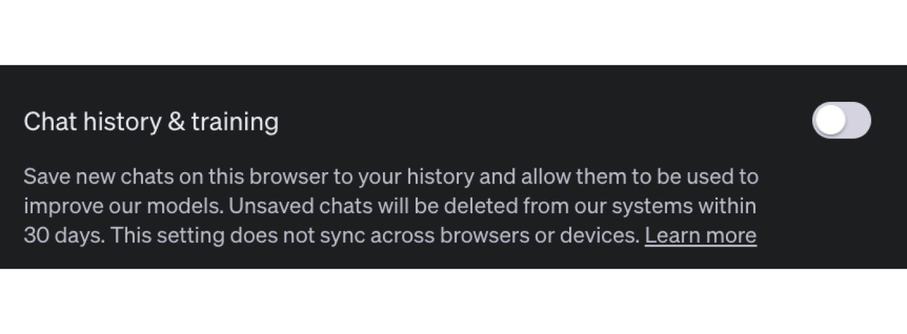
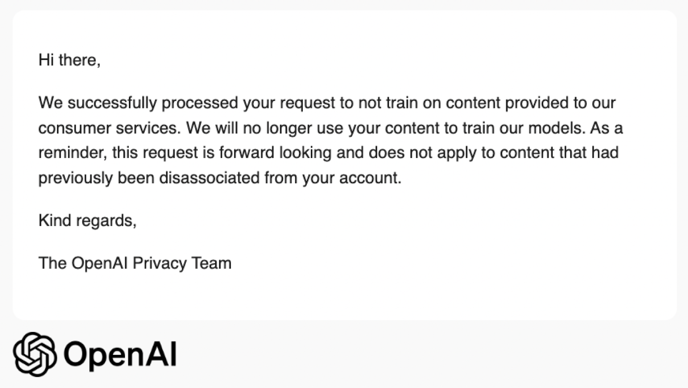
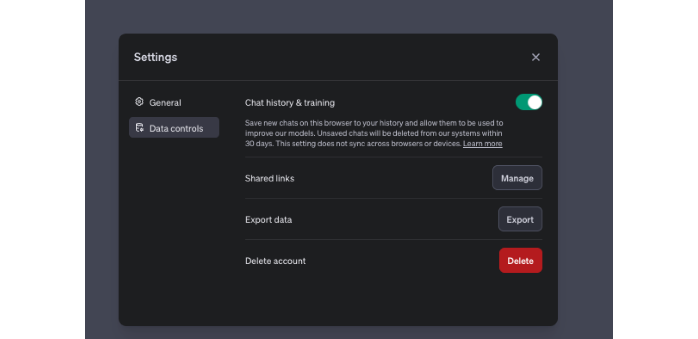
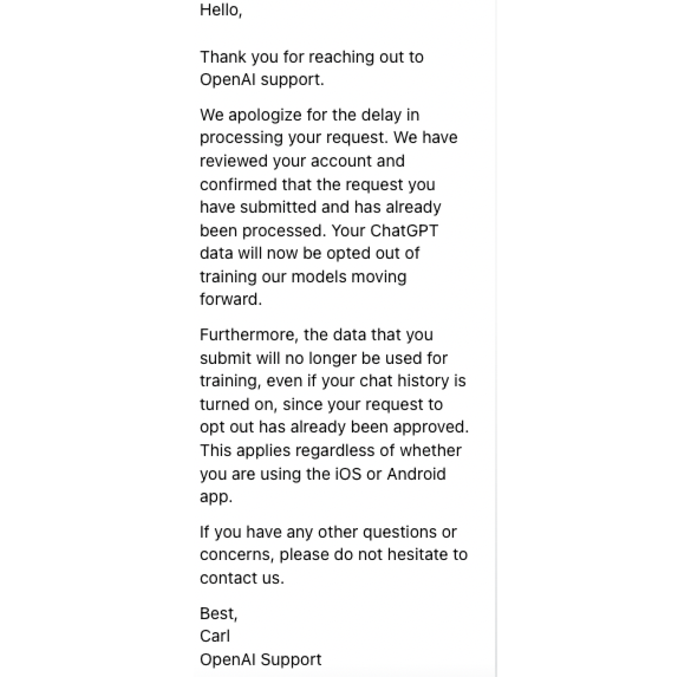
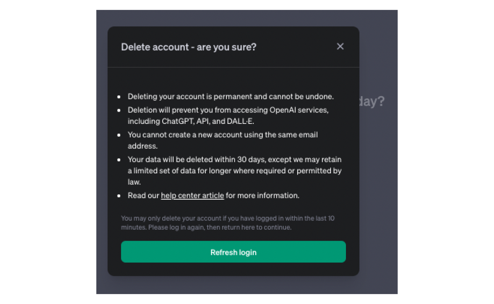

**Have you ever wondered how to stop OpenAI from learning from your data while keeping the history of your chats? We’ve got the solution for that! As our apps are gaining superpowers by integrating and using OpenAI features we should stop for a moment and think about the privacy of various solutions. Hopefully, this blog post will help you make smart decisions and allay doubts. If you just want to understand the basic privacy rules of OpenAI solutions, this article is also for you.**

It is the start of 2024. You might remember that we had a [blog post](https://brightinventions.pl/blog/software-development-trends/) about development trends for 2023 - one of them was about GPT. Frankly speaking, this was quite a good prediction - GPT’s and OpenAI are taking the world. There are more and more use cases for LLM’s in the apps we create every day - summary of the text, similarity check or sentiment analysis. We have started to use them for chatbots, virtual copilots or assistants to ease our everyday lives. LLM field of development is moving at a very fast pace, giving out new exciting features every day.

Every day, new LLM solutions are deployed, both closed source like Bard from Google (with PaLM and Gemini), Claude from Anthropic and open source like LLama from Meta or Mistral. Still, LLMs are often associated with OpenAI company. That might be due to the fact that their solution was first in the market, they tend to have developed unbeatable GPT-4 (which competition claims (or not?) to overrun) and easy, straightforward access to API. They are also backed up by Mircosoft gigant, both in founding and infrastructure.

Generally speaking, OpenAI is a default “goto” address for anybody who would like to use LLM or integrate it into his app. Having that in mind, **I will describe most of the relevant OpenAI solutions from the least private to the most private ones**. Please note though that in the end if your use case is a complicated one you should consult a lawyer and OpenAI yourself :).

## OpenAI Trust Portal

**[This](https://trust.openai.com/) is your go-to place for privacy and security when it comes to OpenAI**. Upon this page, we can see that OpenAI is CCPA, GDPR, SOC2 and SOC3 compliant (OpenAI not ChatGPT - please note the difference). You can download or request security papers from OpenAI. You can see the status of their infrastructure, all privacy policies, PII usage, data processing agreement or terms of service. It’s highly recommended to start your privacy journey here!

## ChatGPT Free Privacy and Data Security

With the free version of ChatGPT via web panel, you can use GPT-3.5 chats. Also, recently it should allow you to use Whisper API via iOS and Android WebApps. **By default, it keeps a history of your chats**. ChatGPT web has an opt-out model of data processing which you submit. On their page we can read
<blockquote>
    
When you use our non-API consumer services ChatGPT or Labs, we may use the data you provide us to improve our models.

    <footer>[OpenAI trust portal](https://trust.openai.com/?itemName=data_privacy&source=click)</footer>
</blockquote>

that simply means that data you submit can be used to train the model. If you wonder how the data you provide is stored/processed later they say,

<blockquote>
    
We remove any personally identifiable information from data we intend to use to improve model performance. We also only use a small sampling of data per customer for our efforts to improve model performance.

    <footer>[OpenAI trust portal](https://trust.openai.com/?itemName=data_privacy&source=click)</footer>
</blockquote>

You can opt out of this behavior in the settings of your ChatGPT profile:

*Opt-out from model training*

What is important to mention is that:
<blockquote>
This setting does not sync across browsers or devices. You will have to disable chat & history on each device/browser.
<footer>[OpenAI help portal](https://help.openai.com/en/articles/7730893-data-controls-faq)</footer></blockquote>

The downside of this approach is that **you will not have access to the history of your chats. Another option to opt out but keeping the history saved is**:
<blockquote>
    
In the meantime, you can opt out from our use of your data to improve our services by filling out this form. Once you submit the form, new conversations will not be used to train our models.

    <footer>[OpenAI help portal](https://help.openai.com/en/articles/7730893-data-controls-faq)</footer>
</blockquote>

On [this](https://privacy.openai.com/) page you can make a privacy request for your account. What is worth mentioning, is that when you submit a request and it is accepted, nothing changes from a UI/UX perspective in your account - you have still the possibility to toggle chat history & training but it is not doing anything as you have already opted-out from data processing.

*Successfully opted-out message from support*

*Account settings*

As you can see, even though I opted out of training the data it is still visible in the UI (but actually data is not used for training).  A conversation with the support team has confirmed it:

*Support conversation*

Also important fact is that upon submitting the request you:
<blockquote>
    
understand that this request applies moving forward and does not apply to data that was previously disassociated from my account

</blockquote>
so this request is in force only for future data. In the end, when you opt-out of model training with your data and:
<blockquote>
    
When chat history is disabled, we will retain new conversations for 30 days and review them only when needed to monitor for abuse, before permanently deleting.

    <footer>[OpenAI help portal](https://help.openai.com/en/articles/7730893-data-controls-faq)</footer>
</blockquote>

This is the maximum we can do here as the zero data policy (which we will talk about later) does not apply here.
<blockquote>
    
Note that this data policy does not apply to OpenAI's non-API consumer services like ChatGPT or DALL·E Labs.

    <footer>[OpenAI moderation](https://platform.openai.com/docs/models/moderation)</footer>
</blockquote>

Most probably, during these 30 days it is viewed either by:
<blockquote>
    
A limited number of authorized OpenAI personnel, as well as trusted service providers that are subject to confidentiality and security obligations, may access user content only as needed for these reasons: (1) investigating abuse or a security incident; (2) to provide support to you if you reach out to us with questions about your account; (3) to handle legal matters; or (4) to improve model performance (unless you have opted out). Access to content is subject to technical access controls and limited only to authorized personnel on a need-to-know basis.

    <footer>[OpenAI help portal](https://help.openai.com/en/articles/7039943-data-usage-for-consumer-services-faq)</footer>
</blockquote>

An additional question is - how long my data is stored when I opt-out from data training and I do not disable history? Here’s the info that OpenAI provides on a matter:
<blockquote>
    
Deleted chats are hard deleted from our systems within 30 days, unless they have been de-identified and disassociated from your account. If you have not opted out, we may use these de-identified chats for training to improve model performance.

    <footer>[OpenAI help portal](https://help.openai.com/en/articles/8809935-how-chat-retention-works-in-chatgpt)</footer>
</blockquote>

You have option to toggle delete all chats from preferences of your account. Also, you delete all of data by simply deleting the account. In dialog when deleting account we can see:
<blockquote>
    
Your data will be deleted within 30 days, except we may retain a limited set of data for longer where required or permitted by law.

    <footer>[OpenAI help portal](https://help.openai.com/en/articles/6378407-how-to-delete-your-account)</footer>
</blockquote>

*Delete account prompt*

## ChatGPT Plus Privacy and Data Security

Compared to ChatGPT Free, with ChatGPT Plus you can use GPT-4, create DALEE3 images, search with Bing or recently create & use your own GPTs.
Apart from all the information provided for ChatGPT Free which applies here, what is important to mention is your own ChatGPT retention. As mentioned, **you have a possibility to create your GPT with data knowledge of files with your selection**. As noted in OpenAI community portal, when you create your own GPT, by default:
<blockquote>
    
Use conversation data in your GPT to improve our models.

    <footer>[OpenAI community](https://community.openai.com/t/data-privacy-for-latest-features-gpts-and-assistants/493023/4)</footer>
</blockquote>

is selected. It is unclear if the option of opt-out mentioned in the GPT Free section overrides this selection or not, so if you do not wish to share the data, simply deselect the option. Also, for the files uploaded via UI input prompt or knowledge for custom GPT we can see that:

<blockquote>
    
Files processed via ADA / Document Analysis, and when chatting with a custom GPT (not uploaded as knowledge in GPT config): Retained for 3 hours. Images processed via Vision and Files uploaded as knowledge to custom GPT: Retained indefinitely.

    <footer>[OpenAI help portal](https://help.openai.com/en/articles/8555545-file-uploads-faq)</footer>
</blockquote>

Hopefully this post has given you some insights on privacy in ChatGPT Free and Plus and its opt-out model. If you want to dive into enterprise solutions proposed by OpenAI, [read our another blog post about recently introduced ChatGPT Teams and ChatGPT Enterprise plans](blog/openai-chatgpt-team-enterprise-privacy-policies-explained/). Both of those solutions give us better privacy controls than when using individual subscriptions.

