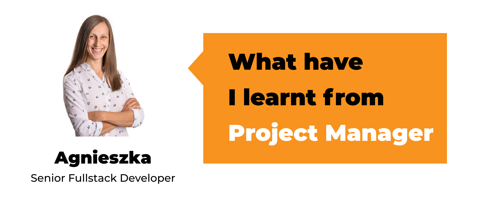

## Code is just a means to an end

Usually, your everyday goal is to write some piece of code. That's what programmers do, isn’t it? And if you are one of these perfectionist guys, you want your code to be more than excellent. So it is so tempting to focus exclusively on that. 

This is a moment where a **good project manager reminds you to look globally at your project**. Your job is to create something worthy for users. When a project manager is focused on delivering value, then they infect you with that focus.

Code is just a part of it. Obviously, it has to work for clients and users. But we do not deliver code, we deliver solutions. Good PM actually constantly remembers you about that. Because it is so easy to fall again (and again) into this “writing perfect code trap”. 

## You are not born with soft skills, you learn how to use them

I consider myself an introvert. Expressing myself is a challenge for me. I used to think that it was the way it was and there was not so much I could do about that. And then we had a communication workshop with our senior project manager – [Kasia](/about-us/kasia/). This workshop was a game-changer. 

**Kasia made me realise that soft skills weren't skills that we were born with (or not).** We can learn them as much as we learn how to read or drive a car. And that changed my perspective and approach to communication. 

I never was a fan of networking or small talk but I just learnt how to do it, how to be better at that. And some could say – “What is to learn here?” Probably that is something natural to them. Maybe for me it isn’t but it doesn't mean I couldn’t do it. I just had to practice it a little bit harder. And **good PM shows you the way to express yourself and to communicate**. Then you see the sense of calls, meetings and standups. 😉

## A project manager is not here to tell you what to do

Before I started to work on my first project with PM, I thought that this person would only take care of my tasks. She would write and manage tasks in Jira and I wouldn’t have to do it. So I was glad to have that person on board. 

When I started to cooperate with Kasia I was extremely happy but for other reasons. Kasia didn’t do any job for me. And she didn’t tell me what to do either. She exceeded my expectations. I understood who a good PM is and how this relationship amazingly works for me. 

PM is not a person who stands over me and shows me my mistakes, asks when things will be done or praise me when I do something right. **PM should push you in a delicate way.** They ask questions, help to find you the solution. Metaphorically speaking – PMs give you a chair but they do not give you a keyboard. 🙃

When I observe how our PM uses management tools and conducts internal & external meetings, I try to act the same. Why? Because I see all the value coming from that. I understand what she does and I feel what it gives me.

It is so hard to explain how it feels to have a good relationship with PMs… You just have to work with that unique person to really understand that. Kudos to Kasia who really changed my assumptions about working with PM and was an inspiration to this article. Sorry if this piece still didn’t show you all the PM powers. I guess you have to live it to feel it. 😉
