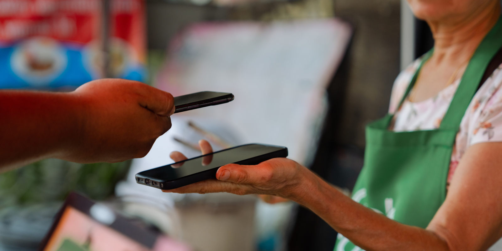
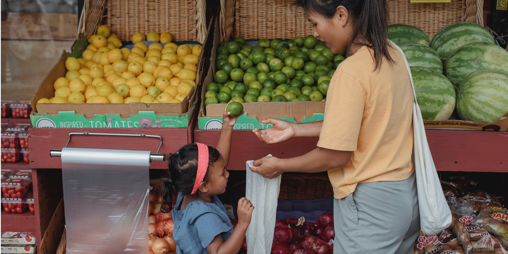

---
team_members:
  - kasia g
our_service:
  - MVP development
  - web development
  - mobile app development
layout: project
project_id: Card Tracking System
title: From MVP to a Solution Helping People in Asia and Africa
image: /images/case_study_cover_card_tracking_new.png
description: Introducing the Card Tracking System, a digital marvel that is not
  just code but a life-changing force across Asia and Africa. This system
  distributes essential payment instruments, bringing hope and support where it
  is needed most. We could not be prouder to play a part in this incredible
  project. Together, we're making a real impact in the world.
hero_image: /images/case_study_card_distribution.png
Hero Image_alt: Card Tracking System
social_media_previev: /images/some_preview_card_tracker.png
social_media_previev_alt: Card Tracking System
bar_achievements:
  - number: 10+
    label: Countries where the system operates
  - number: 500k
    label: Cards administration
  - number: "4"
    label: Years of collaboration
tags:
  - web app
  - mobile app
  - fintech
  - customized software
title_team: team behind the project
title_case_study: more success stories
title_contact: let's talk about your product
description_contact: Tell us more about your mobile project or idea for an app.
  Fill out the form below and we'll get back to you in 48 hours.
order: 5
slug: card-tracking-system
show_team: false
show_case_study: true
show on homepage: false
published: true
language: en
---
<TitleWithIcon sectionTitle="technologies" titleIcon="/images/skills.svg" titleIconAlt="technologies" />

<Gallery images='[{"src":"/images/react_stack_logo.svg","alt":"React"},{"src":"/images/node_stack_logosvg.svg","alt":"Node.js"},{"src":"/images/nestjs_stack_logo.svg","alt":"NestJS"},{"src":"/images/kotlin_new_stack_logo.svg","alt":"Kotlin"},{"src":"/images/aws_stack_logo.svg","alt":"AWS"}]' />

**technologies:** React.js + Redux, MaterialUI + styled-components, Node.js, NestJS, Kotlin, AWS – CloudFormation, TeamCity

<TitleWithIcon sectionTitle="harnessing the power of technology to aid" titleIcon="/images/icon_title_about.svg" titleIconAlt="Harnessing the power of technology to aid" />

In the world affected by military conflicts, social inequalities and the rising number of refugees the aid provided by **NGOs and humanitarian organizations must undergo digitalization to effectively address global challenges**.

While media coverage often focuses on refugees making long journeys to Europe or the USA, the reality is that **the majority of refugees reside in Asian countries**. According to [resque.com](https://www.rescue.org/article/facts-about-refugees-key-facts-faqs-and-statistics) Jordan hosts the second-highest number of refugees per capita in the world.

In regions such as Africa and Asia, far removed from the global media spotlight and influencer attention, the battle for an improved quality of life is ongoing. **Humanitarian organizations strive to aid not only refugees but also those hailing from the poorest regions and those who have lost their means of livelihood** and shelter due to natural disasters.

Technology must become a handful tool for organizations aiming to help. **The Card Tracker System is one of the humanitarian projects harnessing the power of technology for aid**.

<TitleWithIcon sectionTitle="the story behind Card Tracking System" titleIcon="/images/icon_title_products.svg" titleIconAlt="The story behind Card Tracking System" />

Our client, **one of the leading global humanitarian agencies, approached us looking to create a system that would improve their payment instrument distribution process**. As part of the agency's ongoing effort to support people in need in some of our planet's poorest regions, **the agency distributes payment instruments (prepaid cards, SIM cards, vouchers, etc.) to local communities around the globe**. This, in turn, **allows beneficiaries to acquire essential items** like food, hygiene products, and other necessities for their families.

The client required a **system that would follow the payment instruments at every stage** – all the way from the point of order to distributing them to the beneficiaries and beyond. The system was required to show the cards' status to ensure they fulfilled their purpose: giving resources to families living below the poverty line. Any fraudulent activity was to be tracked by the system and dealt with accordingly by the staff on the ground.

The system didn't monitor the payment transactions the card was used in. Still, it tracks the handing over of cards between different departments and organizations within the humanitarian agency. Thanks to that, **the client can quickly check how many cards are ready to be distributed and how many have already been passed on to end users**.

The system was developed on two platforms. **The web application acts as the back office application, mainly displaying events logs and the issued cards' status**. Meanwhile, the **Android mobile application enables scanning of the cards**, sending data between the on-the-ground staff and the offices, and recording when they are distributed to the end users. In this project, **Bright Inventions handled every aspect of the project**, from product design work all the way to backend and frontend development to deployment and maintenance.

<AnchorLink href='#contactForm' text='let’s talk about your project'/>

<TitleWithIcon sectionTitle="goal: easy adjustment to local laws and regulations" titleIcon="/images/icon_title_goal.svg" titleIconAlt="Goal: easy adjustment to local laws and regulations" />

The project goal was to **create an automated, transparent, and uniform system allowing the delivery of payment instruments to people in need**. The system has to work globally; therefore, it has to be easily adjustable to local law and the specific situations of different communities in Africa and Asia. The system also requires to **support card distribution in poor internet coverage areas**, making an offline mode a must.

<TitleWithIcon sectionTitle="how did Bright Inventions help to make this system unique and live? " titleIcon="/images/gearwheel.svg" titleIconAlt="How did Bright Inventions help to make this system unique and live? " />

We had the privilege of **starting the whole development process from scratch**, starting with the product design side of the proceedings. The development process required us to **turn the manual card distribution process into a digital flow**.

The Card Tracking System was **developed as an MVP**. The goal was to build crucial features, release the product, and quickly verify if it meets the clients and their users' expectations. As the **feedback for the initial MVP was positive**, we started further work on delivering the full version of the app.

<TitleWithIcon sectionTitle="responding to unique challenges refugees have to encounter" titleIcon="/images/clients_perspective_icon.svg" titleIconAlt="Responding to unique challenges refugees have to encounter" />

The social impact this solution would make meant the discovery and prototyping phase was crucial in establishing an understanding of the various aspects of the project. For example, during the process, we found that the **eligibility criteria for an individual to receive the cards varies from country to country** and is sometimes linked to the specific life circumstances of the beneficiaries.

We also had to **account for people without the proper ID required by the local authorities**. Some of the refugees in question left their homes so quickly that they did not have any documents at all. Each of these instances affected the flow of the app, creating more work for the product design team.

**Close cooperation with the agency employees was vital during the prototyping and discovery phase**. These people work on the ground and understand the local processes and circumstances the refugees face. The information they shared through a series of interviews was crucial in understanding the solution needed. These interviews allowed us to customize the final product to the needs of the staff working across the humanitarian agency.

<AnchorLink href='#contactForm' text='let’s talk about your project'/>

<TitleWithIcon sectionTitle="result of collaboration: a system with dozen implementations" titleIcon="/images/icon_result_svg.svg" titleIconAlt="Result of collaboration" />

At Bright Inventions, **we are honored that we could develop a card tracking system that supports the daily jobs of humanitarian agency employees** helping them to organize aid during missions in areas affected by natural disasters, climate change, or wars. The local people can use the cards distributed to meet their most basic needs. **Our client's efforts not only result in helping people in the crises of poverty but also help to stimulate the local economies**.

**A pilot of the system was launched in 2020** in one of the Middle Eastern countries where the agency operates. The reception has been positive, and **the system was rolled out across other countries in the Middle East and Africa**. 

We are still working on the system, constantly developing new features, offering maintenance and assistance in launching the application in the new markets. The social impact certainly makes this a gratifying experience for our team, and we are thrilled to develop it with the client.