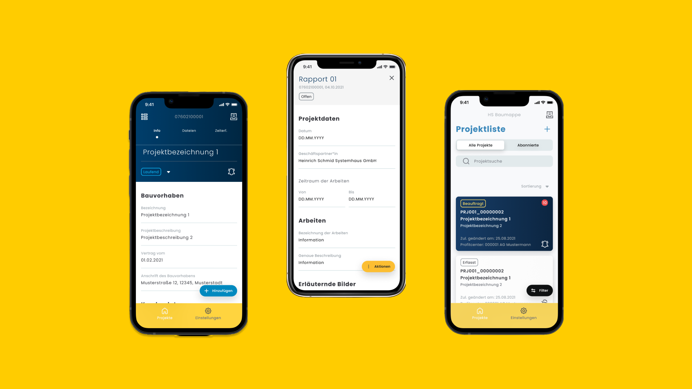
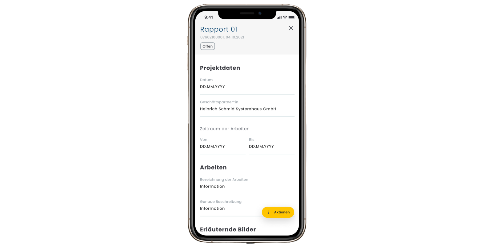
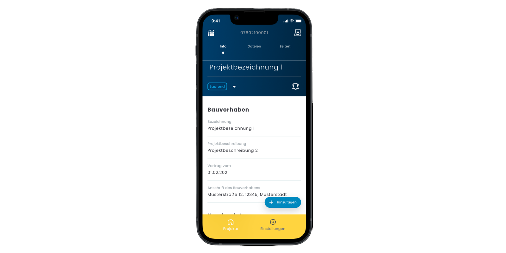
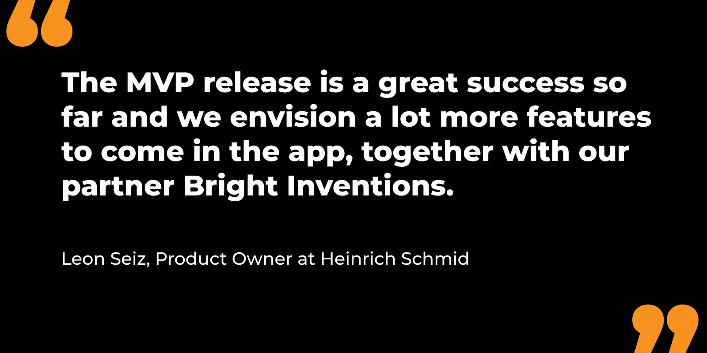

---
team_members:
  - kasia g
  - piotr_r
  - krzysiek-s
  - lukasz-n
  - michal-was
our_service:
  - MVP development
  - mobile app development
layout: project
project_id: HS-Baumappe
title: "Navigating Digital Transformation at Construction Sites: Heinrich
  Schmid's Doc-Sharing App"
image: /images/case_study-cover_hs_baumappe.png
description: The Heinrich Schmid Group is a distinguished provider of
  construction services, with a rich history spanning over 110 years. With such
  strong foundations, the group has consistently grown aligning closely with the
  path of digital transformation. We have helped Heinrich Schmid digitize their
  daily operations on its construction sites by developing a robust HS Baumappe
  mobile application.
hero_image: /images/baumappe_case_study_construction.png
Hero Image_alt: Document Management Apps for Construction
social_media_previev: /images/fb_preview-case-study.png
social_media_previev_alt: HS Baumappe – Document Management Apps for Construction
bar_achievements:
  - number: 110+
    label: Years in the market
  - number: 2+
    label: Years of collaboration
  - number: "5"
    label: Team members
tags:
  - mobile app
  - customized software
  - MVP
title_team: meet the team
title_case_study: check other case studies
title_contact: let's talk about your product
description_contact: Tell us more about your mobile project or idea for an app.
  Fill out the form below and we'll get back to you in 48 hours.
order: 5
slug: document-management-apps-construction
show_team: false
show_case_study: false
show on homepage: true
published: true
work_in_progress: false
language: en
---
<TitleWithIcon sectionTitle="technologies" titleIcon="/images/skills.svg" titleIconAlt="technologies" />

<Gallery images='[{"src":"/images/swift.png","alt":"Swift"},{"src":"/images/kotlin.png","alt":"Kotlin"},{"src":"/images/new_logo_figma_stack.png","alt":"Figma"},{"src":"/images/github_stack_logo.png","alt":"Github"}]' />

**technologies**: SwiftUI, Apollo GraphQL, CoreData, Sourcery, Bitrise, Jetpack Compose, Hilt, offline-first approach, Jira, Figma, GitHub Actions.

<TitleWithIcon sectionTitle="problem: site construction staff overloaded with paper documentation" titleIcon="/images/icon_title_about.svg" titleIconAlt="problem" />

Imagine stepping into the **bureaucratic world of construction site personnel**, where every day is a navigation through a sea of paperwork. Employees need access to a collection of documents, from architectural plans, site photographs to daily reports, timesheets, and others. Additionally, they generate numerous documents on-site, adding to the already substantial pile of documentation.

**What if all this paperwork were just one click away on a smartphone or tablet?** Critical documents would no longer be misplaced or damaged at construction sites, and access to sensitive information would be limited to individuals with the appropriate credentials.

<TitleWithIcon sectionTitle="solution: digital document sharing with a mobile app" titleIcon="/images/gearwheel.svg" titleIconAlt="the solution" />

Our client, Heinrich Schmid, is a building construction group, eagerly embracing digital transformation. **One of their goals was to manage the whole construction documentation** via smartphone or tablet and eliminate paper documentation. We were pleased to help them with this transition.

**Our team takes care exclusively of mobile development**. The backend is developed by another software company. It requires close cooperation between various development teams to sync apps with the backend properly.

Mockup examples designed by Heinrich Schmid's Product Design Team.

**The initial phase involved launching the MVP – HS Baumappe iOS and Android applications** designed to facilitate the creation and sharing of documents among the construction crew, clients, and external contractors. Thanks to **sophisticated access management**, only employees with the appropriate credentials can access the various documents, significantly enhancing security and data protection.

The client trusted us to choose the most optimal solutions, therefore we use top tools such as **SwiftUI or Jetpack Compose highly recommended by Apple and Android**.

We also made a strategic decision regarding the app architecture. We decided to **build HS Baumappe as a multi-module application**. Instead of building an app as a huge monolith, we separated the code into single responsibility modules. As a result, it improved developers’ productivity, code clarity, and interoperability. It also **helps to save costs and scale the solution during the post-MVP phase**.

<TitleWithIcon sectionTitle="the challenge of building the document management app for construction" titleIcon="/images/two_flags.svg" titleIconAlt="challenge " />

The client trusted us to choose the most optimal solutions, therefore we use top tools such as SwiftUI or Jetpack Compose highly recommended by Apple and Android.

We also made a strategic decision regarding the app architecture. We decided to build HS Baumappe as a multi-module application. Instead of building an app as a huge monolith, we separated the code into single responsibility modules. As a result, it improved developers’ productivity, code clarity, and interoperability. It also helps to save costs and scale the solution during the post-MVP phase.

Construction sites are places where **the internet connection is weak or simply doesn’t exist**. Therefore from the beginning, the priority was to build the **offline-first application**. It needed plenty of preparations during the requirement phase to determine when and how the apps should operate depending on the quality of the internet connection.

Developing **offline mode** is always an interesting technological challenge. However, this is a feature that we successfully delivered for our other clients (check [vCare](/projects/vCare) case study). Thanks to an offline mode users can create any document without an internet connection and the app will store the data on the user’s device. All files will be synchronized when the internet connection is back.

Mockup example designed by Heinrich Schmid's Product Design Team.

<TitleWithIcon sectionTitle="HS Baumappe development process" titleIcon="/images/gearwheel.svg" titleIconAlt="HS Baumappe development process" />

**Heinrich Schmid reached out to us in 2021 with a strong vision of the mobile apps** based on the web solution they had already been using in their organization. The client knew exactly what features they needed to continue a digital transformation of the construction site doc workflow. Heinrich Schmid provided us with designs reviewed by their internal testing group representing end users.

Bright Inventions team consists of **4 experienced mobile developers and a project manager**. We take full advantage of Scrum working in **2-week sprints**.

The first step was to **release the MVP** and present it to the client’s employees to gather feedback.

The client trusted us to choose the best solutions for native application development. Therefore we use top tools such as **SwiftUI** or **Jetpack Compose**. It’s worth mentioning that the Android application’s UI is built from the scratch with Jetpack Compose and Jetpack Compose Navigation.

Mockup example designed by Heinrich Schmid's Product Design Team.

We also made an important decision regarding the app architecture. We decided to build **HS Baumappe as a multi-module application**. Instead of building an app as a huge monolith, we **separated the code into single responsibility modules**. As a result, it improved developers’ productivity because of the **shorter build time, clarity and interoperability**. Developing multi-module apps is not something visible to users but takes a huge part in fastening the development process and, in the end, helps to **save costs**.

Bright Inventions’ team takes care **exclusively of mobile development**. The backend is developed by another software company. It requires close cooperation between various development teams to sync apps with the backend properly.

**HS Baumappe was released in December 2022 as an MVP**. Now the focus group is testing the solution and is gathering extended feedback regarding the UX and features.

<TitleWithIcon sectionTitle="client’s perspective" titleIcon="/images/clients_perspective_icon.svg" titleIconAlt="client’s perspective" />

*The collaboration with Bright Inventions started off very promising. Based on our business needs, **they gave great architectural advice, important technical information, and overall good guidance**, which allowed an ambitious start into the project.*

*After months of smooth development and satisfying output, we were challenged with some very critical technical barriers, which collided with our business vision of the app. Due to great proactive efforts on Bright Inventions side, the Heinrich Schmid IT team, and the good communication towards our third-party backend developer team, we overcame this hurdle and managed to get the app behavior as envisioned and desired.* 

*With the currently ongoing MVP release, the only point of criticism our users raised is the following: “We want more features!”. Therefore, the **MVP release is a great success** so far and we envision a lot more features to come in the app, together with our partner Bright Inventions.*

**Leon Seiz, Product Owner at Heinrich Schmid**

<TitleWithIcon sectionTitle="what’s next for Heinrich Schmid and Bright Inventions?" titleIcon="/images/icon_result_svg.svg" titleIconAlt="result" />

Our team is **working on other features such as time tracking and performance recording**. We plan to release another app version dedicated to a bigger group of end users. **The ultimate goal is to deliver mobile apps that all Heinrich Schmid construction crews will use**.