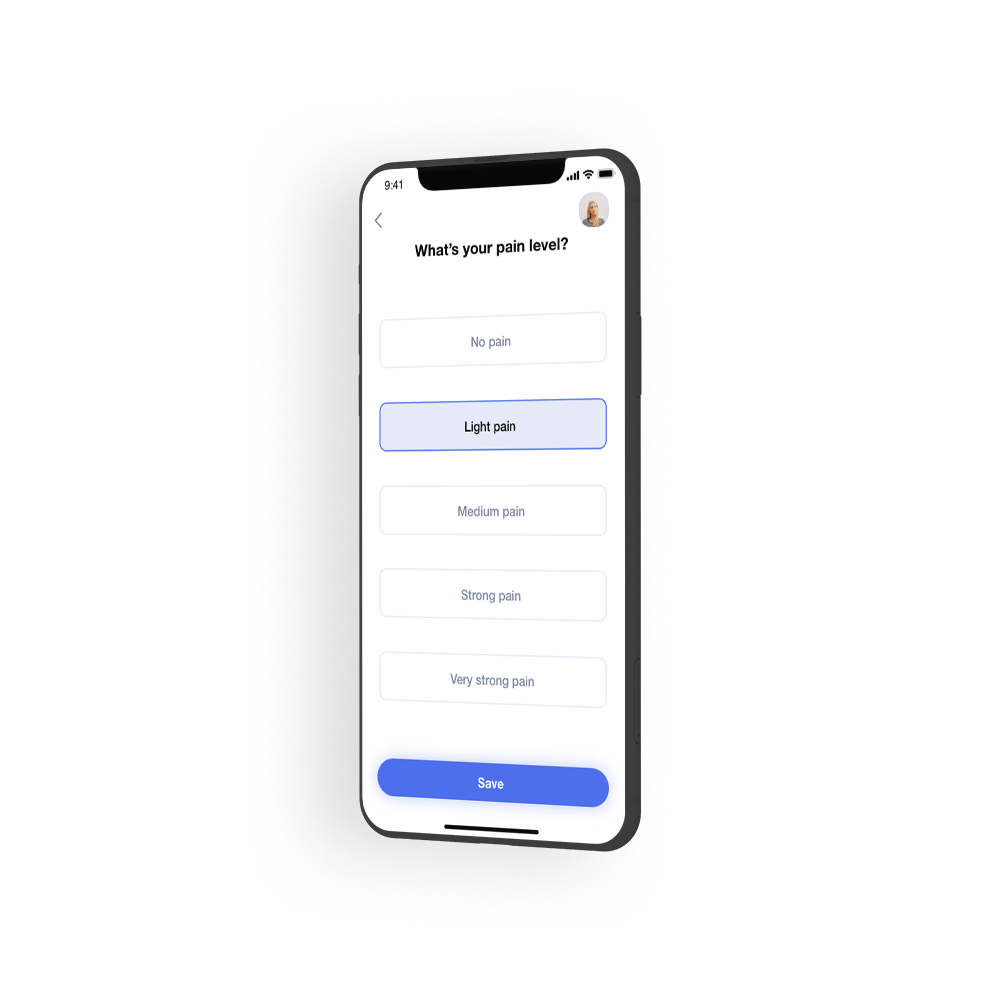
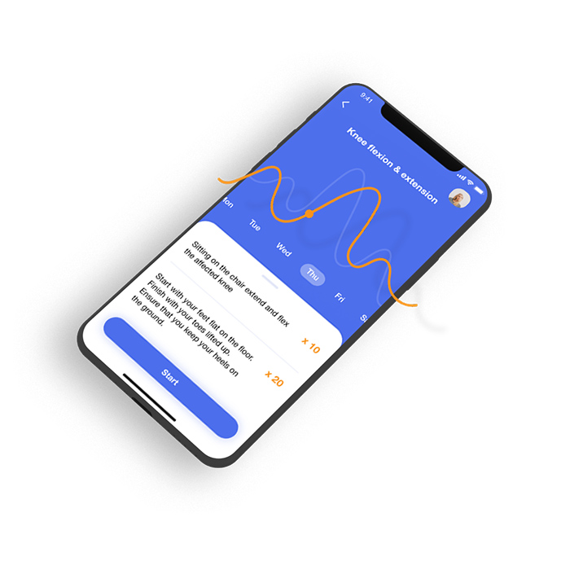

---
team_members:
  - michal
our_service:
  - mobile app development
  - MVP development
layout: project
project_id: mobile-therapy-application
title: Mobile Therapy Application
image: /images/mobile_therapy_app1.jpg
description: A healthcare mobile application that supports patients going
  through physiotherapy. It offers therapists an easy way to customize plans for
  each patient.
hero_image: /images/case_study_ehealth_mobile_app.png
Hero Image_alt: Therapy app
social_media_previev: /images/therapy_fb_preview.png
social_media_previev_alt: Mobile Therapy App case study
bar_achievements:
  - number: "2"
    label: iOS and Android apps
  - number: "6"
    label: Months to MVP launch
  - number: "5"
    label: Key MVP featuers
tags:
  - mobile app
  - customized software
  - eHealth
title_team: team
title_case_study: more success stories
title_contact: let’s talk about your product
description_contact: Contact us and we'll get back in 48 hours.
order: 99
slug: mobile-therapy-application
show_team: false
show_case_study: true
show on homepage: false
published: true
language: en
---

*It is not a real implemented design. It is a mockup example created for the purpose of case study.*

<TitleWithIcon sectionTitle='main features' titleIcon='/images/main_features_icon.png' titleIconAlt='main features' />

* Therapist module (user panel)
* Patient module (user panel)
* Data tracking system
* Custom animations
* Background connection between patient's and therapist's devices

<TitleWithIcon sectionTitle='skills' titleIcon='/images/skills.svg' titleIconAlt='stack/skills' />

<Gallery images='[{"src":"/images/swift.png","alt":"Swift"},{"src":"/images/kotlin.png","alt":"Kotlin"},{"src":"/images/node.png","alt":"node.js"},{"src":"/images/new_typescript_logo_stack.png","alt":"TypeScript"},{"src":"/images/postgresql_logo_stack.png","alt":"PostgreSQL"},{"src":"/images/aws.png","alt":"AWS"},{"src":"/images/react.png","alt":"React"}]' />

**iOS:** Swift, RxSwift, Alamofire

**Android:** Kotlin, RxJava, Retrofit, Dagger

**Backend:** Node.js, Typescript, PostgreSQL, AWS Services

**Frontend:** React, Typescript

<TitleWithIcon sectionTitle='intro' titleIcon='/images/three_flags.svg' titleIconAlt='intro' />

At some point in our lives, either we ourselves or our loved ones will require physiotherapy to get back on our feet. However, there are many factors that influence whether this will be a stress-free and effective process.\
With this in mind, our client created an app that supports therapists and patients on their way to a fast (and lasting!) recovery.

*It is not a real implemented design. It is a mockup example created for the purpose of case study.*

<TitleWithIcon sectionTitle='goal' titleIcon='/images/goal_title_section.png' titleIconAlt='goal' />

Our client, a product design agency and an early-stage project incubator, has turned to us with a ready-to-implement idea for an app. Before reaching out to Bright Inventions, they had already spent months validating their concept by observing physiotherapy sessions. This resulted in a comprehensive plan for an app that would solve the biggest challenges patients and therapists face.

**These include**

* Limited time therapists have for each patient
* Patients tending to forget how to perform their exercises properly
* Patients not exercising regularly enough
* Exercises recommended by therapists are often repetitive among patients.

Our client also had a high-fidelity wireframe of the app, and entrusted us with the implementation of the entire system, comprised of:

\- iOS and Android apps

\- Backend

\- Content Management System (used, for instance, for storing step-by-step video tutorials for patients)

\- An admin panel for therapists.

*It is not a real implemented design. It is a mockup example created for the purpose of case study.*

<TitleWithIcon sectionTitle='development process' titleIcon='/images/gearwheel.svg' titleIconAlt='process' />

One of the key challenges for the system was making sure that it matched the way physical therapy looks like in real life. As visits tend to be very short, it was crucial that the therapist and patients would be able to link their accounts in the app quickly. Naturally, not all patients already had the app when they came in, nor did everyone feel comfortable with using new technologies. Low levels of tech-savviness meant it was difficult for them to download the app, register an account, and – most importantly – link their profiles with those of therapists.

We decided to solve the latter problem by automating the linking of patient-therapist profiles through a previously generated and printed code. This enables patients to link their accounts after the physiotherapy session is over, from the comfort of their homes. By inserting the code in the app, they’re now able to download their prescribed exercise plan.

We also needed to create separate modules for patients and therapists.

On the patient profile, one could download the therapy plan, as well as use the app on a daily basis for exercise and progress tracking. The patient’s app also features reminders and motivates the patient to continue on his/her path to recovery by displaying therapy statistics.

The therapist panel was much more sophisticated. Firstly, it needed to allow therapists to customize plans for each patient. They also needed to plan out exercise sessions on a calendar and include information on the number of circuits per each exercise. Additionally, they needed an option to store photos and videos recorded during the patient’s therapeutic session. Alternatively, they were also to choose from a library of tutorial videos stored in the CMS.

<TitleWithIcon sectionTitle='result' titleIcon='/images/results_icon_title_small.png' titleIconAlt='result' />

Our work with the client lasted until the MVP was built and refined. The entire cooperation took place for half a year. Six months later, our clients put up the app for sale. Quickly, an interested party decided to order an audit of the software before making an offer. Upon a positive review of the service, the company decided to finalize their purchase and are now developing the app with an in-house development team.
